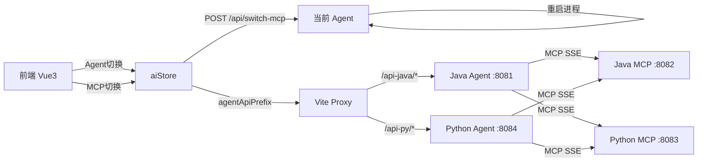

# Python 双栈深度优化 — SSE 修复 + 2×2 自由组合

修复 Python Agent SSE 流式响应无回显问题，并将前端从"Java/Python 整体切换"改造为 Agent 和 MCP 独立切换的 2×2 自由组合模式。

## User Review Required

> [!IMPORTANT]
> **LLM 兼容性风险**：`ChatDeepSeek` 类名暗示 DeepSeek 专用，当前 `.env` 配置的是阿里内部 `idealab` API + `Qwen3.6-Plus-DogFooding` 模型。需要验证 `ChatDeepSeek` 是否兼容 OpenAI-compatible API，若不兼容需换用 `ChatOpenAI`。

> [!WARNING]
> **2×2 切换涉及 Agent 进程重启**：前端选择 MCP 后，需要通知后端重启 Agent 进程（约 5-10s），期间 Agent 不可用。用户需知晓此延迟。

---

## Phase 1: 修复 Python Agent SSE 无回显

### 根因分析

SSE 无回显的可能原因链：
1. `config_loader.py` 的 `get_llm_config()` 已修改为环境变量优先 ✅（已完成）
2. `ChatDeepSeek` 可能不兼容阿里内部 OpenAI-compatible API（需验证）
3. `lru_cache` 缓存了旧配置（进程未重启）

### 1.1 Agent 模型层修复

#### [MODIFY] [agent.py](file:///Users/xuhu/workspace/xuhuLocal/test-learn-agent/finance-agent-py/agent.py)

将 `ChatDeepSeek` 替换为 `ChatOpenAI`（OpenAI-compatible，兼容所有 provider）：

```diff
- from langchain_deepseek import ChatDeepSeek
+ from langchain_openai import ChatOpenAI

  self._model = ChatOpenAI(
-     model=llm_config["model"],
-     api_key=llm_config["api_key"],
-     api_base=llm_config["base_url"],
-     temperature=0.1,
+     model=llm_config["model"],
+     api_key=llm_config["api_key"],
+     base_url=llm_config["base_url"],
+     temperature=0.1,
  )
```

#### [MODIFY] [requirements.txt](file:///Users/xuhu/workspace/xuhuLocal/test-learn-agent/finance-agent-py/requirements.txt)

```diff
- langchain-deepseek>=0.1.0
+ langchain-openai>=0.3.0
```

### 1.2 验证 SSE 流式功能

启动 Python Agent + MCP Server，在前端测试"我的余额是多少"。

---

## Phase 2: 2×2 自由组合改造

### 架构设计



**切换流程**：
1. 用户在前端独立选择 Agent（Java/Python）和 MCP（Java/Python）
2. 切换 Agent：仅修改前端 `agentApiPrefix`，请求发到另一个 Agent 进程（无需重启）
3. 切换 MCP：前端通知当前 Agent 重启并连接新 MCP Server（需 5-10s 重启）

---

### 2.1 前端改造

#### [MODIFY] [aiStore.js](file:///Users/xuhu/workspace/xuhuLocal/test-learn-agent/finance-frontend/src/stores/aiStore.js)

- 添加独立的 `mcpType` ref + `switchMcp()` 方法
- `switchAgent` 仅切换 `agentApiPrefix`（无需重启）
- `switchMcp` 调用当前 Agent 的 `/api/switch-mcp` 接口，Agent 重启 MCP 连接
- 添加 `mcpLabel` computed
- localStorage 持久化 `agentType` 和 `mcpType`

#### [MODIFY] [AppHeader.vue](file:///Users/xuhu/workspace/xuhuLocal/test-learn-agent/finance-frontend/src/components/AppHeader.vue)

- Agent 切换改为 `el-select`（Java Agent / Python Agent）
- 新增 MCP 切换 `el-select`（Java MCP / Python MCP）
- 布局：`Agent: [select] | MCP: [select]`
- 切换 MCP 时显示"正在重启..."loading 提示

#### [MODIFY] [ChatPanel.vue](file:///Users/xuhu/workspace/xuhuLocal/test-learn-agent/finance-frontend/src/components/ChatPanel.vue)

- watch `agentType` 和 `mcpType` 变化：清空对话 + 显示切换提示
- 切换 MCP 时显示"MCP 切换中，请稍候..."

---

### 2.2 Python Agent 支持动态 MCP 切换

#### [MODIFY] [chat_server.py](file:///Users/xuhu/workspace/xuhuLocal/test-learn-agent/finance-agent-py/chat_server.py)

新增 `POST /api/switch-mcp` 端点：
- 接收 `{"mcpType": "java"}` 或 `{"mcpType": "python"}`
- 关闭当前 Agent 的 MCP 连接
- 根据 `mcpType` 计算新 MCP URL（java→:8082, python→:8083）
- 重新初始化 Agent（连接新 MCP Server）
- 返回 `{"success": true, "mcpType": "java"}`

#### [MODIFY] [agent.py](file:///Users/xuhu/workspace/xuhuLocal/test-learn-agent/finance-agent-py/agent.py)

添加 `reconnect_mcp(new_mcp_url)` 方法：
- 关闭旧 MCP SSE 连接
- 连接新 MCP Server
- 重新加载工具列表
- 重建 Agent

---

### 2.3 Java Agent 支持 MCP URL 动态切换

#### [MODIFY] [application.yml](file:///Users/xuhu/workspace/xuhuLocal/test-learn-agent/finance-agent/src/main/resources/application.yml)

MCP URL 从环境变量读取：

```diff
    mcp:
      client:
        type: SYNC
        sse:
          connections:
            finance-mcp:
-              url: http://localhost:8082
+              url: ${MCP_SSE_URL:http://localhost:8082}
```

#### [NEW] [McpSwitchController.java](file:///Users/xuhu/workspace/xuhuLocal/test-learn-agent/finance-agent/src/main/java/com/example/agent/controller/McpSwitchController.java)

新增 `POST /api/switch-mcp` 端点：
- 接收 `{"mcpType": "java"}` 或 `{"mcpType": "python"}`
- 修改环境变量 `MCP_SSE_URL`
- 调用 `ApplicationContext.refresh()` 或通过脚本重启 Java Agent 进程
- 由于 Spring AI MCP Client 在启动时绑定，**Java Agent 需要进程级重启**
- 返回前端重启状态

> [!NOTE]
> Java Agent 的 MCP 切换需要进程重启。前端在调用 `/api/switch-mcp` 后轮询 `/actuator/health` 等待 Agent 恢复。

---

### 2.4 启动脚本适配

#### [MODIFY] [start-all.sh](file:///Users/xuhu/workspace/xuhuLocal/test-learn-agent/start-all.sh)

- `--all` 模式同时启动 4 个后端服务（Backend + Java MCP + Python MCP + Java Agent + Python Agent）
- 新增 `restart-agent` 子命令：支持指定 Agent 类型 + MCP URL 重启

#### [MODIFY] [config.yaml](file:///Users/xuhu/workspace/xuhuLocal/test-learn-agent/config.yaml)

```diff
  ai:
-   agent: python
-   mcp: python
-   mode: single
+   mode: dual          # dual: 同时启动所有服务，支持前端动态切换
```

---

## Verification Plan

### Automated Tests

```bash
# Python 语法检查
python3 -m py_compile finance-agent-py/agent.py
python3 -m py_compile finance-agent-py/chat_server.py

# 前端测试
cd finance-frontend && npx vitest run --reporter=verbose
```

### Manual Verification

1. **Phase 1 验证**：启动 Python Agent + Python MCP + Backend，在前端切换到 Python Agent，发送"我的余额是多少"，确认 SSE 流式回显正常
2. **Phase 2 验证**：启动所有 4 个服务，测试 4 种 Agent+MCP 组合：
   - Java Agent + Java MCP → 发送查询 → 正常回显
   - Java Agent + Python MCP → 切换 MCP → 等待重启 → 发送查询
   - Python Agent + Java MCP → 切换 Agent + MCP → 发送查询
   - Python Agent + Python MCP → 发送查询
3. 验证 localStorage 持久化：刷新页面后 Agent 和 MCP 选择保持

---
生成时间: 2026/5/27 13:48:45
planId: 585e3811-d0b5-4693-8c2d-01341f775001
plan_status: review