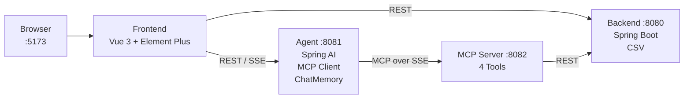
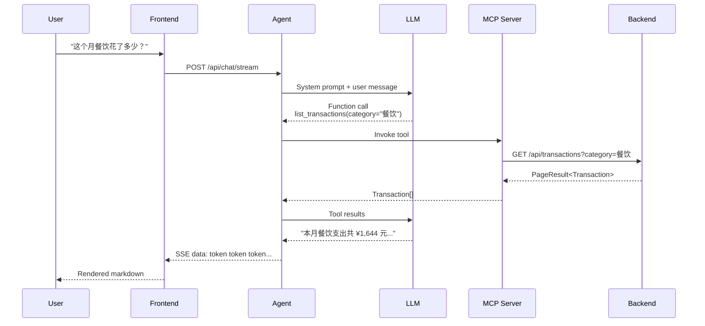
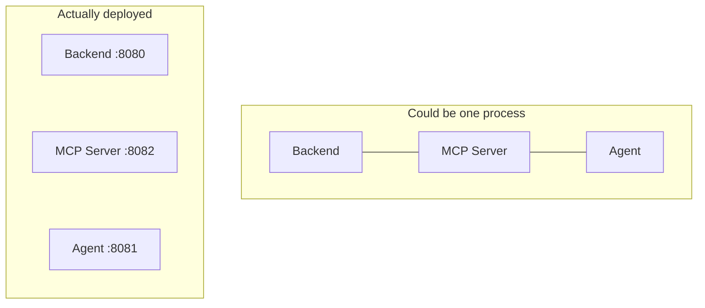

# Personal Finance Agent · AI-Powered Bookkeeping

[](https://opensource.org/licenses/MIT)
[](https://adoptium.net/)
[](https://spring.io/projects/spring-boot)
[](https://vuejs.org/)
[](https://element-plus.org/)

A learning demo for **AI Agent** and **MCP (Model Context Protocol)** in the Java ecosystem — personal finance bookkeeping you can talk to.

[中文](README_CN.md) | English

---

## What is this?

A 4-service project that explores how to build AI-powered applications on the JVM. You record daily expenses and income, then query them through natural language conversation. The AI understands your intent, calls the right APIs via MCP tools, and returns formatted results — with streaming output and conversation memory.

**What you can learn from this codebase:**
- How MCP protocol bridges LLMs and business APIs
- How Spring AI integrates with OpenAI-compatible models
- How to implement SSE streaming from LLM to browser, token by token
- How to structure a multi-service Java project with clean boundaries

---

## Architecture



**4 services, 1 protocol chain.** The frontend talks to both the Backend (for CRUD) and the Agent (for AI chat). When the Agent needs data, it doesn't call the Backend directly — it goes through the MCP Server, which exposes Backend APIs as standardized MCP tools.

---

## AI Chat Flow

Here's what happens when a user asks *"How much did I spend on dining this month?"*



The key insight: **the LLM decides which tool to call.** We don't hardcode any intent matching. The system prompt tells the LLM what tools are available, and it autonomously invokes them — this is the core of the Agent pattern.

---

## Why 4 Separate Services?

You could put all Java code in a single Spring Boot app. This project deliberately splits them:



**The split isn't about production best practice — it's about learning.**

| Service | Role | Knows about AI? | Knows about business? |
|---------|------|:---:|:---:|
| Backend | Pure REST API + CSV storage | No | Yes |
| MCP Server | Wraps REST as MCP tools | No | No (just passes through) |
| Agent | MCP Client + LLM orchestration | Yes | No |
| Frontend | UI, calls both Backend and Agent | No | No |

This separation makes the MCP layer **visible and tangible**. In a real system you might merge the MCP Server with the Backend, but here you can see exactly where the protocol boundary sits.

---

## Design Decisions

**CSV instead of a database** — Zero setup. Clone, configure your LLM key, run. No MySQL, no Docker. CSV files are human-readable for debugging.

**`.env` for configuration** — One file for LLM credentials. Spring Boot loads it natively via a custom `PropertySourceLoader` that teaches it the `.env` extension. No environment variables needed.

**SSE over WebSocket** — The Agent streams tokens to the browser via Server-Sent Events. It's unidirectional (server → client), which is exactly what streaming LLM output needs. Simpler than WebSocket, works through HTTP proxies.

**Multi-user via `userId` param** — A pseudo-login with a `<select>` dropdown. No real auth — but every API call and MCP tool invocation carries a `userId`, teaching the pattern of multi-tenant data isolation without the ceremony of OAuth.

---

## Quick Start

**Prerequisites:** Java 17+, Node.js 18+

```bash
# 1. Clone
git clone https://github.com/your-username/personal-finance-agent.git
cd personal-finance-agent

# 2. Configure LLM
cp .env.example .env
# Edit .env → paste your API key

# 2b. Activate git hooks (commit lint + auto-push)
git config core.hooksPath githooks

# 3. Install frontend deps
cd finance-frontend && npm install && cd ..

# 4. Start all services
./start-all.sh

# 5. Open http://localhost:5173
```

> **Tip:** If Maven complains about compilation, ensure `JAVA_HOME` points to JDK 17. The wrapper defaults to your system Java — which might be 8.

**Manual start (4 terminals, for debugging):**

```bash
# T1: Backend
cd finance-backend && ./mvnw spring-boot:run

# T2: MCP Server
cd finance-mcp-server && ./mvnw spring-boot:run

# T3: Agent
cd finance-agent && ./mvnw spring-boot:run

# T4: Frontend
cd finance-frontend && npm run dev
```

---

## Project Map

```
.
├── finance-backend/         Spring Boot · REST API · CSV via Jackson CsvMapper
│   └── src/.../controller, service, repository, model
├── finance-mcp-server/      Spring AI MCP · @McpTool annotations · SSE transport
│   └── src/.../tool/FinanceTools.java  ← 4 tools, 1 file
├── finance-agent/           Spring AI ChatClient · MCP Client · ChatMemory
│   └── src/.../controller/ChatController.java  ← /chat, /chat/stream
├── finance-frontend/        Vue 3 · Element Plus · ECharts · SSE streaming
│   └── src/components/      ← 7 components, 1 store
├── .env.example             LLM config template → cp to .env
└── start-all.sh             One-click startup
```

Each module is self-contained with its own `pom.xml` (Java) or `package.json` (frontend). No shared code between them — they communicate only over HTTP.

---

## AI Chat Examples

```
You: 我的账户余额是多少？
AI: 您的默认现金账户当前余额为 ¥20,273.96 元。

You: 这个月餐饮花了多少钱？
AI: 本月餐饮支出共 ¥1,644 元，共 26 笔。

You: 帮我记一笔：午餐 50 元
AI: 已为您记录：支出 ¥50.00，分类：餐饮，备注：午餐。
```

All queries go through the MCP tool chain. The AI never fabricates data — the system prompt instructs it to call tools for every financial question.

---

## Using with Claude Desktop

Since the MCP Server speaks standard MCP protocol:

```json
{
  "mcpServers": {
    "finance": {
      "url": "http://localhost:8082/sse"
    }
  }
}
```

Add this to `claude_desktop_config.json` and Claude can directly query your bookkeeping data.

---

## FAQ

**Can I use a different LLM?** Yes. Edit `.env` — any OpenAI-compatible API works (OpenAI, Qwen, Groq, Moonshot, SiliconFlow, etc.).

**Port already in use?**
```bash
lsof -ti:8080 | xargs kill -9  # Backend
lsof -ti:8081 | xargs kill -9  # Agent
lsof -ti:8082 | xargs kill -9  # MCP Server
lsof -ti:5173 | xargs kill -9  # Frontend
```

**Reset all data?** `rm -rf finance-backend/data`

## License

MIT © 2026
