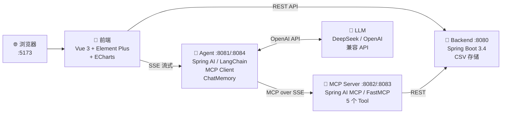
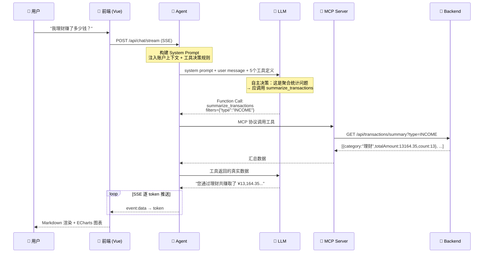
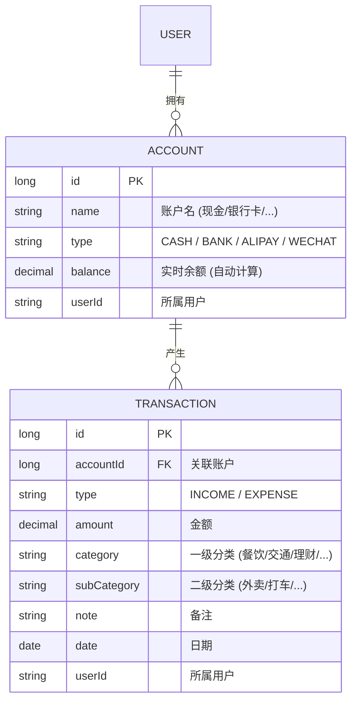

# Personal Finance Agent · AI 记账助手

[](https://opensource.org/licenses/MIT)
[](https://adoptium.net/)
[](https://www.python.org/)
[](https://spring.io/projects/spring-boot)
[](https://docs.spring.io/spring-ai/)
[](https://www.langchain.com/)
[](https://vuejs.org/)
[](https://github.com/features/actions)

一个学习型 Demo，在 Java 和 Python 双生态体系下实践 **AI Agent** 和 **MCP 协议（Model Context Protocol）**——可以对话的记账应用。

中文 | [English](README_EN.md)

---

## 这是什么？

一个包含 6 个独立服务模块的全栈项目，探索如何用 **Java Spring AI** 和 **Python LangChain** 两套技术栈构建 AI 驱动的应用。记录日常收支，然后通过自然语言对话查询数据。AI 理解你的意图，通过 MCP 工具调用正确的 API，返回格式化结果——支持 **SSE 流式输出**和**对话记忆**。

**你能从这个代码库中学到：**
- MCP 协议如何桥接 LLM 和业务 API
- Spring AI 与 LangChain 分别如何构建 AI Agent
- FastMCP（Python）与 Spring AI MCP（Java）两种 MCP Server 实现对比
- 如何实现从 LLM 到浏览器的逐字 SSE 流式输出
- 通过 `config.yaml` 配置切换 Java/Python 服务实现
- 如何组织多服务项目的清晰边界

---

## 系统架构



**双技术栈，同一份底层服务：**

| 层 | Java 实现 | Python 实现 | 端口（可配置） |
|------|-----------|-------------|:---:|
| **Agent** | `finance-agent` (Spring AI) | `finance-agent-py` (LangChain) | 8081 / 8084 |
| **MCP Server** | `finance-mcp-server` (Spring AI MCP) | `finance-mcp-server-py` (FastMCP) | 8082 / 8083 |
| **Frontend** | `finance-frontend` (Vue 3) | — | 5173 |
| **Backend** | `finance-backend` (Spring Boot) | — | 8080 |

通过根目录 `config.yaml` 一键切换 Java/Python 实现：

```yaml
# config.yaml
ai:
  agent: python   # java | python
  mcp: python     # java | python
```

前端右上角实时显示当前 AI 提供者，点击可查看详情。

---

## 项目地图

```
.
├── config.yaml                        # AI 提供者配置（Agent/MCP 语言选择）
├── start-all.sh                       # 一键启动（读取 config.yaml 条件启动）
│
├── finance-backend/                   Spring Boot 3.4 · REST API · CSV 存储
│   ├── controller/                    AccountController, TransactionController
│   ├── service/                       FinanceService (业务逻辑 + 聚合统计)
│   ├── repository/                    CsvDataStore (原子写入 + 内存索引)
│   ├── exception/                     GlobalExceptionHandler (统一错误响应)
│   └── util/                          XssUtils, LogMaskUtils
│
├── finance-mcp-server/                Spring AI MCP · @McpTool 注解
│   └── tool/FinanceTools              5 个工具, parseFilters 辅助方法
│
├── finance-mcp-server-py/             Python FastMCP · 功能对等
│   └── server.py                      5 个 MCP 工具 (SSE transport)
│
├── finance-agent/                     Spring AI 1.1 · MCP Client · ChatMemory
│   ├── controller/                    ChatController (/chat/stream SSE)
│   ├── context/                       AccountContextBuilder (30s 缓存)
│   ├── memory/                        对话记忆 (max 20 轮)
│   └── metrics/                       AgentMetrics (TTFT, Token 用量)
│
├── finance-agent-py/                  Python LangChain · ReAct Agent · 功能对等
│   ├── agent.py                       FinanceAgent (MCP 工具 + DeepSeek LLM)
│   ├── chat_server.py                 FastAPI SSE 流式接口
│   ├── system_prompt.py               System Prompt + 账户上下文注入
│   ├── memory_manager.py              JSON 文件对话记忆
│   └── config_loader.py               .env + config.yaml 加载
│
├── finance-frontend/                  Vue 3 · Element Plus · ECharts
│   ├── components/                    9 个组件 (ChatPanel, ChartRenderer...)
│   ├── stores/                        Pinia (userStore, aiStore)
│   └── utils/                         api.js, streamParser.js, markdown.js
│
├── .github/workflows/ci.yml           GitHub Actions CI
├── .env.example                       LLM 配置模板
└── githooks/                          commit-msg (Conventional Commits)
```

每个模块独立构建，互不共享代码——仅通过 HTTP / MCP 协议通信。

---

## Agent 调用架构

用户问 *"我理财赚了多少钱？"* 时的完整流转：



**核心设计：LLM 自主决定调用哪个工具。** System Prompt 内置参数决策规则（如"涉及汇总用 summarize_transactions"），LLM 据此判断并调用——这就是 Agent 模式的核心。

---

## 记账应用设计

### 数据模型



### 存储设计

**CSV 文件存储**——零环境依赖，clone + 配 Key 就能跑：

```
finance-backend/data/
├── accounts.csv        # id,name,type,balance,userId
└── transactions.csv    # id,accountId,type,amount,category,subCategory,note,date,userId
```

- 启动时全量加载到内存 `ConcurrentHashMap`
- 写入时原子重命名（临时文件 → 正式文件），避免数据损坏
- 按 `userId` 隔离数据，模拟多租户

### MCP 工具清单

| 工具 | 功能 | 参数 |
|------|------|------|
| **`summarize_transactions`** | 按分类汇总交易金额统计 | `userId`, `filters` (JSON) |
| **`list_transactions`** | 查询交易记录明细列表 | `userId`, `filters` (JSON) |
| **`add_transaction`** | 添加一笔交易记录 | `userId`, `accountId`, `type`, `amount`, `category`, `subCategory`, `note` |
| **`list_accounts`** | 查询用户全部账户列表 | `userId` |
| **`query_balance`** | 按 accountId 查询余额 | `userId`, `accountId` |

> 可选参数通过 `filters` JSON 字符串传入（如 `{"type":"INCOME","category":"理财"}`），避免 MCP Schema 的 required/optional 歧义。

### 后端 API

| 方法 | 路径 | 功能 |
|------|------|------|
| `GET` | `/api/accounts` | 查询账户列表 |
| `POST` | `/api/accounts` | 创建账户 |
| `GET` | `/api/accounts/{id}/balance` | 查询余额 |
| `GET` | `/api/transactions` | 分页查询交易记录（支持日期范围/分类/类型过滤） |
| `GET` | `/api/transactions/summary` | 按分类汇总统计 |
| `POST` | `/api/transactions` | 创建交易记录 |
| `GET` | `/api/categories` | 获取分类列表 |

> 集成 SpringDoc OpenAPI，启动后访问 `http://localhost:8080/swagger-ui.html` 查看完整文档。

### 前端组件


- **移动端**自动切换为 Tab 模式（📊 数据 / 💬 助手）
- **ChatMessage** 支持 Markdown 表格、代码高亮、XSS 防护
- **ChartRenderer** 自动检测表格数据并生成 ECharts 图表
- **AppHeader** 右上角显示当前 AI 提供者标识（Python/Java），点击可切换

---

## 为什么要拆成 6 个模块？

把代码塞进一个项目也能跑。故意拆开是为了学习：

| 服务 | 职责 | 知道 AI？ | 知道业务？ |
|------|------|:---:|:---:|
| **Backend** | 纯 REST API + CSV 存储 | ✗ | ✓ |
| **MCP Server** | 将 REST 包装为 MCP 工具 | ✗ | ✗（纯透传） |
| **Agent** | MCP Client + LLM 编排 | ✓ | ✗ |
| **Frontend** | UI，同时调 Backend 和 Agent | ✗ | ✗ |

Agent 和 MCP Server 各有 Java/Python 两套实现，功能完全对等。通过 `config.yaml` 切换——方便对比两套技术栈的异同。

---

## 技术栈

| 层 | 技术 | 版本 |
|----|------|------|
| **前端** | Vue 3 + Element Plus + ECharts + Pinia | 3.5 / 2.14 / 6.1 / 3.0 |
| **前端工具** | Vite + Vitest + ESLint | 8.0 / 4.1 / 10.4 |
| **后端** | Spring Boot + SpringDoc OpenAPI | 3.4.5 / 2.8.6 |
| **AI 框架 (Java)** | Spring AI + MCP Protocol | 1.1.0 |
| **AI 框架 (Python)** | LangChain + langchain-mcp-adapters + LangGraph | 0.3+ |
| **MCP Server (Python)** | FastMCP (mcp) | 1.x |
| **LLM** | DeepSeek / OpenAI / 通义千问 (任何兼容 API) | — |
| **CI/CD** | GitHub Actions (Java 17 + Node 18) | — |

---

## 设计决策

| 决策 | 为什么 |
|------|--------|
| **CSV 而非数据库** | 零环境依赖，clone + 配 Key 就跑。CSV 文件可直接用文本编辑器打开调试 |
| **`.env` 配置** | 一份文件搞定 LLM 凭证。Java 用自定义 `PropertySourceLoader`，Python 用 `python-dotenv` |
| **`config.yaml` 切换** | 通过配置文件选择 Java/Python 实现，前端实时感知当前提供者 |
| **SSE 而非 WebSocket** | 单向推送契合流式 LLM 输出，比 WebSocket 简单，能穿透 HTTP 代理 |
| **`userId` 参数隔离** | 顶部切换用户，无真正鉴权。演示多租户数据隔离思路 |
| **filters JSON 参数** | 将可选参数合并为 JSON 字符串，避免 MCP Schema 的 required/optional 歧义 |
| **System Prompt 决策规则** | 内置工具选择规则（如"汇总用 summarize_transactions"），减少 LLM 反复推理 |
| **Agent 外部初始化** | Python Agent 在 uvicorn 启动前完成 MCP 连接，避免 FastAPI lifespan 与 anyio cancel scope 冲突 |

---

## 快速开始

### 环境要求

- **Java 17+**（推荐 [Adoptium](https://adoptium.net/)）
- **Python 3.11+**（Python 服务需要）
- **Node.js 18+**
- **LLM API Key**（DeepSeek / OpenAI / 通义千问等）

### 一键启动

```bash
# 1. 克隆
git clone https://github.com/reallyhwc/test-learn-agent.git
cd test-learn-agent

# 2. 配置 LLM
cp .env.example .env
# 编辑 .env → 填入你的 API Key

# 3. 配置 AI 提供者（可选，默认 java）
# 编辑 config.yaml → 设置 ai.agent 和 ai.mcp 为 java 或 python

# 4. 一键启动（读取 config.yaml，按需启动服务，含健康检查）
./start-all.sh

# 5. 打开 http://localhost:5173
```

> **提示：** 如果 Maven 编译报错，检查 `JAVA_HOME` 是否指向 JDK 17（`/usr/local/opt/openjdk@17` 或 SDKMAN）。

### config.yaml 说明

```yaml
ai:
  agent: python   # Agent 实现语言：java (Spring AI) | python (LangChain)
  mcp: python     # MCP Server 实现语言：java (Spring AI MCP) | python (FastMCP)
```

当前默认值为 `python`（Python Agent + Python MCP Server），可根据需要切换：
- **全 Java 栈**：agent=java, mcp=java → 使用 :8081 和 :8082
- **全 Python 栈**：agent=python, mcp=python → 使用 :8084 和 :8083
- **混合栈**：agent=java, mcp=python 或 agent=python, mcp=java

### 手动启动

```bash
# Java 栈
cd finance-backend && ./mvnw spring-boot:run          # Backend :8080
cd finance-mcp-server && ./mvnw spring-boot:run        # MCP Server :8082
cd finance-agent && ./mvnw spring-boot:run             # Agent :8081

# Python 栈
cd finance-mcp-server-py && python3 server.py          # MCP Server :8083
cd finance-agent-py && python3 main.py                 # Agent :8084

# 前端
cd finance-frontend && npm run dev                     # :5173
```

### 环境变量

| 变量 | 必填 | 说明 | 默认值 |
|------|:----:|------|--------|
| `LLM_API_KEY` | ✅ | LLM API Key | — |
| `LLM_BASE_URL` | ✅ | OpenAI 兼容 API 地址 | `https://api.deepseek.com` |
| `LLM_MODEL` | ✅ | 模型名称 | `deepseek-chat` |

支持：**DeepSeek**、**通义千问**、**OpenAI**、**Groq**、**Moonshot**、**SiliconFlow** 等任何 OpenAI 兼容 API。

---

## AI 对话示例

```
你: 我的账户余额是多少？
AI: 您的默认现金账户当前余额为 ¥20,273.96 元。

你: 我理财赚了多少钱？
AI: 您通过理财共赚取了 ¥13,164.35，累计 13 笔交易。

你: 帮我记一笔：午餐 50 元
AI: 已为您记录：支出 ¥50.00，分类：餐饮，备注：午餐。
```

所有查询都走 MCP 工具链路。AI 不会编造数据——System Prompt 要求每次必须调用工具获取真实数据。

---

## 测试体系

```
测试覆盖: 后端 ~46 用例 + 前端 70 用例 + MCP ~16 用例
```

| 层 | 框架 | 覆盖范围 |
|----|------|----------|
| **后端 Controller** | Spring MockMvc | 账户/交易 CRUD、分页、日期范围过滤、聚合统计 |
| **后端 Service** | JUnit 5 | CSV 读写、多用户隔离、余额计算 |
| **后端异常处理** | MockMvc | GlobalExceptionHandler 统一响应格式 |
| **MCP 工具** | MockRestServiceServer | 5 个工具正常/异常路径、入参校验、JSON 降级 |
| **前端组件** | Vitest + Vue Test Utils | ChatPanel、ChatMessage、TransactionForm |
| **前端 Store** | Vitest | Pinia userStore 持久化、用户切换 |
| **前端工具** | Vitest | API 封装、SSE 流解析、Markdown 渲染、图表提取 |
| **CI** | GitHub Actions | 自动化测试 + ESLint + 覆盖率 + OWASP 安全扫描 |

运行测试：
```bash
# 前端
cd finance-frontend && npx vitest run

# 后端（含 MCP Server）
cd finance-backend && ./mvnw verify
cd finance-mcp-server && ./mvnw verify
```

---

## Claude Desktop 接入

MCP Server 对外暴露标准 MCP 协议端点。取决于你的配置，使用对应端口：

```json
{
  "mcpServers": {
    "finance": {
      "url": "http://localhost:8082/sse"
    }
  }
}
```

- Java MCP Server → `http://localhost:8082/sse`
- Python MCP Server → `http://localhost:8083/sse`

加到 `claude_desktop_config.json`，Claude Desktop 就能直接查询你的记账数据。

---

## 常见问题

**能用其他大模型吗？** 可以。编辑 `.env` 切换——任何 OpenAI 兼容 API 都行。

**端口被占用？**
```bash
lsof -ti:8080,8081,8082,8083,8084,5173 | xargs kill -9
```

**怎么重置数据？** `rm -rf finance-backend/data`

**Swagger 文档在哪？** 启动 Backend 后访问 `http://localhost:8080/swagger-ui.html`

**健康检查？**

| 服务 | 健康检查 URL |
|------|-------------|
| Backend | `http://localhost:8080/actuator/health` |
| Agent (Java) | `http://localhost:8081/actuator/health` |
| MCP Server (Java) | `http://localhost:8082/actuator/health` |
| MCP Server (Python) | `http://localhost:8083/sse` |
| Agent (Python) | `http://localhost:8084/actuator/health` |

**Python 服务启动报错？** 检查 pip 依赖是否安装：
```bash
pip3 install -e finance-mcp-server-py/
pip3 install -e finance-agent-py/
```

---

## License

MIT © 2026
