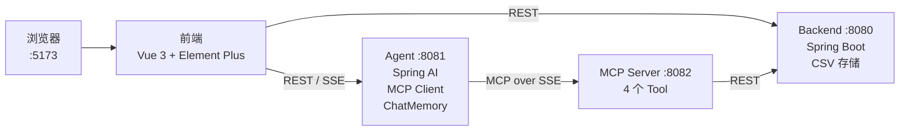
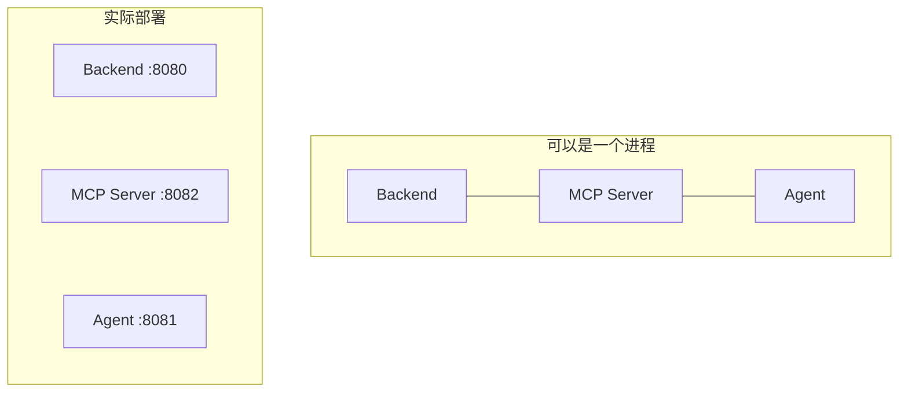

# Personal Finance Agent · AI 记账助手

[](https://opensource.org/licenses/MIT)
[](https://adoptium.net/)
[](https://spring.io/projects/spring-boot)
[](https://vuejs.org/)
[](https://element-plus.org/)

一个学习型 Demo，在 Java 生态体系下实践 **AI Agent** 和 **MCP 协议（Model Context Protocol）**——可以对话的记账应用。

[English](README.md) | 中文

---

## 这是什么？

一个包含 4 个独立服务的项目，探索如何在 JVM 上构建 AI 驱动的应用。记录日常收支，然后通过自然语言对话查询数据。AI 理解你的意图，通过 MCP 工具调用正确的 API，返回格式化结果——支持流式输出和对话记忆。

**你能从这个代码库中学到：**
- MCP 协议如何桥接 LLM 和业务 API
- Spring AI 如何集成 OpenAI 兼容模型
- 如何实现从 LLM 到浏览器的逐字 SSE 流式输出
- 如何组织多服务 Java 项目的清晰边界

---

## 系统架构



**4 个服务，1 条协议链路。** 前端同时对接 Backend（记账 CRUD）和 Agent（AI 对话）。Agent 需要数据时，不直接调 Backend，而是通过 MCP Server——后者将 Backend API 包装为标准 MCP 工具。

---

## AI 对话流程

用户问 *"这个月餐饮花了多少？"* 的全过程：

```mermaid
sequenceDiagram
    participant U as 用户
    participant F as 前端
    participant A as Agent
    participant L as LLM
    participant M as MCP Server
    participant B as Backend

    U->>F: "这个月餐饮花了多少？"
    F->>A: POST /api/chat/stream
    A->>L: System prompt + 用户消息
    L-->>A: Function call<br/>list_transactions(category="餐饮")
    A->>M: 调用工具
    M->>B: GET /api/transactions?category=餐饮
    B-->>M: PageResult&lt;Transaction&gt;
    M-->>A: Transaction[]
    A->>L: 工具返回的真实数据
    L-->>A: "本月餐饮支出共 ¥1,644 元..."
    A-->>F: SSE: data: token token token...
    F-->>U: 渲染 Markdown
```

核心洞察：**由 LLM 自主决定调用哪个工具。** 我们没有硬编码任何意图匹配逻辑。System prompt 告诉 LLM 有哪些工具可用，它自己判断并调用——这就是 Agent 模式的核心。

---

## 为什么要拆成 4 个服务？

把 Java 代码塞进一个 Spring Boot 项目也能跑。故意拆开是为了学习：



**拆分不是为了生产最佳实践，而是为了看清每一层。**

| 服务 | 职责 | 知道 AI？ | 知道业务？ |
|------|------|:---:|:---:|
| Backend | 纯 REST API + CSV 存储 | 不 | 是 |
| MCP Server | 将 REST 包装为 MCP 工具 | 不 | 不（纯透传） |
| Agent | MCP Client + LLM 编排 | 是 | 不 |
| Frontend | UI，同时调 Backend 和 Agent | 不 | 不 |

这种分离让 MCP 层**可见且可感知**。真实系统中可以把 MCP Server 合并到 Backend，但这里你能清楚看到协议边界究竟在哪里。

---

## 设计决策

**CSV 而非数据库**——零环境依赖。clone 下来配好 LLM Key 就能跑。不用 MySQL，不用 Docker。CSV 文件可以直接用文本编辑器打开调试。

**`.env` 配置文件**——一份文件搞定 LLM 凭证。Spring Boot 通过自定义 `PropertySourceLoader` 原生加载 `.env` 文件，不需要手动 export 环境变量。

**SSE 而非 WebSocket**——Agent 通过 Server-Sent Events 向浏览器逐字推送 token。SSE 是单向的（服务端→客户端），正好契合流式 LLM 输出的场景。比 WebSocket 简单，能穿透 HTTP 代理。

**多用户通过 `userId` 参数**——顶部下拉框切换用户，不搞真正的鉴权。但每个 API 调用和 MCP 工具调用都携带 `userId`，演示了多租户数据隔离的思路，不需要 OAuth 那套仪式感。

---

## 快速开始

**环境要求：** Java 17+、Node.js 18+

```bash
# 1. 克隆
git clone https://github.com/your-username/personal-finance-agent.git
cd personal-finance-agent

# 2. 配置 LLM
cp .env.example .env
# 编辑 .env → 填入你的 API Key

# 2b. 激活 git hooks（commit 格式校验 + 自动推送）
git config core.hooksPath githooks

# 3. 安装前端依赖
cd finance-frontend && npm install && cd ..

# 4. 一键启动
./start-all.sh

# 5. 打开 http://localhost:5173
```

> **提示：** 如果 Maven 编译报错，检查 `JAVA_HOME` 是否指向 JDK 17。`mvnw` 默认用系统 Java——可能是 Java 8。

**手动启动（4 个终端窗口，方便调试）：**

```bash
# T1: Backend
cd finance-backend && ./mvnw spring-boot:run

# T2: MCP Server
cd finance-mcp-server && ./mvnw spring-boot:run

# T3: Agent
cd finance-agent && ./mvnw spring-boot:run

# T4: Frontend
cd finance-frontend && npm run dev
```

---

## 项目地图

```
.
├── finance-backend/         Spring Boot · REST API · Jackson CsvMapper
│   └── .../controller, service, repository, model
├── finance-mcp-server/      Spring AI MCP · @McpTool 注解 · SSE 传输
│   └── .../tool/FinanceTools.java  ← 4 个工具，1 个文件
├── finance-agent/           Spring AI ChatClient · MCP Client · ChatMemory
│   └── .../controller/ChatController.java  ← /chat, /chat/stream
├── finance-frontend/        Vue 3 · Element Plus · ECharts · SSE 流式
│   └── src/components/      ← 7 个组件，1 个 store
├── .env.example             LLM 配置模板 → 复制为 .env
└── start-all.sh             一键启动
```

每个模块有自己的 `pom.xml`（Java）或 `package.json`（前端），互相不共享代码——仅通过 HTTP 通信。

---

## AI 对话示例

```
你: 我的账户余额是多少？
AI: 您的默认现金账户当前余额为 ¥20,273.96 元。

你: 这个月餐饮花了多少钱？
AI: 本月餐饮支出共 ¥1,644 元，共 26 笔。

你: 帮我记一笔：午餐 50 元
AI: 已为您记录：支出 ¥50.00，分类：餐饮，备注：午餐。
```

所有查询都走 MCP 工具链路。AI 不会编造数据——System prompt 要求它每次都必须调用工具获取真实数据。

---

## Claude Desktop 接入

MCP Server 对外暴露标准 MCP 协议：

```json
{
  "mcpServers": {
    "finance": {
      "url": "http://localhost:8082/sse"
    }
  }
}
```

加到 `claude_desktop_config.json`，Claude Desktop 就能直接查询你的记账数据。

---

## 常见问题

**能用其他大模型吗？** 可以。编辑 `.env` 切换——任何 OpenAI 兼容 API 都行（OpenAI、通义千问、Groq、Moonshot、SiliconFlow 等）。

**端口被占用？**
```bash
lsof -ti:8080 | xargs kill -9  # Backend
lsof -ti:8081 | xargs kill -9  # Agent
lsof -ti:8082 | xargs kill -9  # MCP Server
lsof -ti:5173 | xargs kill -9  # Frontend
```

**怎么重置数据？** `rm -rf finance-backend/data`

## License

MIT © 2026
