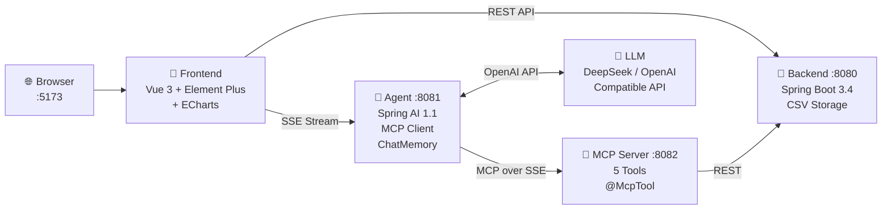
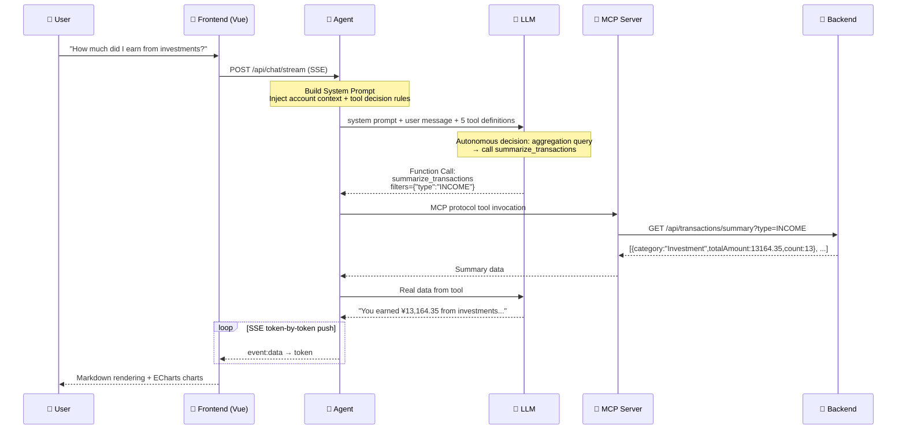
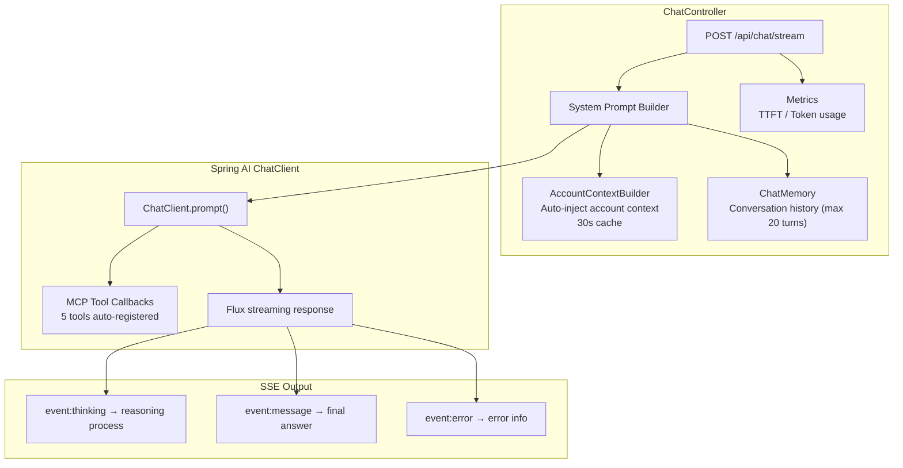
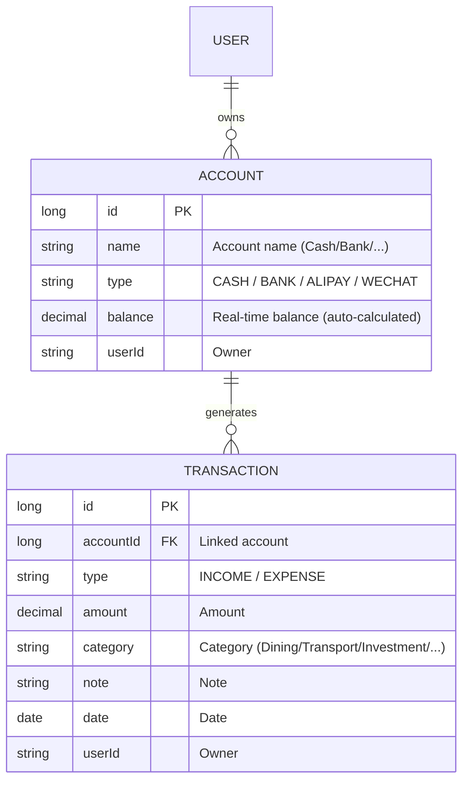
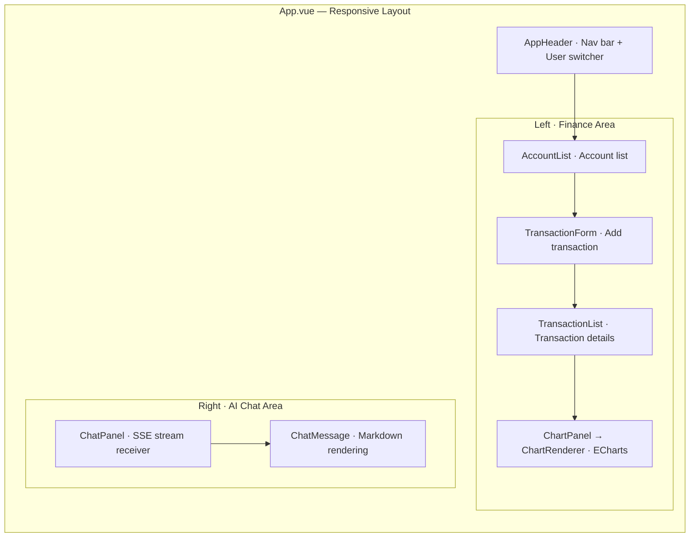

# Personal Finance Agent

[](https://opensource.org/licenses/MIT)
[](https://adoptium.net/)
[](https://spring.io/projects/spring-boot)
[](https://docs.spring.io/spring-ai/)
[](https://vuejs.org/)
[](https://github.com/features/actions)

A learning demo exploring **AI Agent** and **MCP (Model Context Protocol)** on the Java/Spring ecosystem — a personal finance tracker you can chat with.

[中文](README.md) | English

---

## What Is This?

A full-stack project with 4 independent services, exploring how to build AI-driven applications on the JVM. Record daily income and expenses, then query your data through natural language. The AI understands your intent, calls the right API via MCP tools, and returns formatted results — with **SSE streaming** and **conversation memory**.

**What you'll learn from this codebase:**
- How the MCP protocol bridges LLMs and business APIs
- How Spring AI 1.1 integrates with OpenAI-compatible models (DeepSeek, Qwen, etc.)
- How to implement token-by-token SSE streaming from LLM to browser
- How to organize clear boundaries in a multi-service Java project
- How to build a comprehensive frontend + backend test suite

---

## System Architecture



**4 services, 2 data paths:**
- **CRUD path:** Frontend → Backend (direct data operations)
- **AI path:** Frontend → Agent → LLM → MCP Server → Backend (natural language driven)

---

## Agent Call Architecture

What happens when a user asks *"How much did I earn from investments?"*:



### Agent Internals



**Core design: The LLM autonomously decides which tool to call.** The System Prompt embeds decision rules (e.g., "use summarize_transactions for aggregation queries"), and the LLM acts accordingly — the essence of the Agent pattern.

---

## Finance App Design

### Data Model



### Storage Design

**CSV file storage** — zero environment dependencies, clone + set Key and run:

```
finance-backend/data/
├── accounts.csv        # id,name,type,balance,userId
└── transactions.csv    # id,accountId,type,amount,category,note,date,userId
```

- Full data loaded into in-memory `ConcurrentHashMap` on startup
- Atomic write via temp file + rename to prevent corruption
- Data isolated by `userId` to simulate multi-tenancy

### MCP Tool Inventory

| Tool | Function | Parameters |
|------|----------|------------|
| **`summarize_transactions`** | Aggregate transaction amounts by category | `userId`, `filters` (JSON) |
| **`list_transactions`** | Query transaction detail list | `userId`, `filters` (JSON) |
| **`add_transaction`** | Add a transaction record | `userId`, `accountId`, `type`, `amount`, `category`, `note` |
| **`list_accounts`** | List all user accounts | `userId` |
| **`query_balance`** | Query balance by accountId | `userId`, `accountId` |

> Optional parameters are passed via a `filters` JSON string (e.g., `{"type":"INCOME","category":"Investment"}`) to avoid MCP Schema required/optional ambiguity.

### Backend API

| Method | Path | Function |
|--------|------|----------|
| `GET` | `/api/accounts` | List accounts |
| `POST` | `/api/accounts` | Create account |
| `GET` | `/api/accounts/{id}/balance` | Query balance |
| `GET` | `/api/transactions` | Paginated transaction query (date range/category/type filters) |
| `GET` | `/api/transactions/summary` | Aggregate statistics by category |
| `POST` | `/api/transactions` | Create transaction |
| `GET` | `/api/categories` | List categories |

> Integrated with SpringDoc OpenAPI — visit `http://localhost:8080/swagger-ui.html` after startup.

### Frontend Components



- **Mobile** auto-switches to tab mode (📊 Data / 💬 Assistant)
- **ChatMessage** supports Markdown tables, code highlighting, XSS protection
- **ChartRenderer** auto-detects table data and generates ECharts charts

---

## Why 4 Services?

You could stuff all the Java code into a single Spring Boot project. The split is intentional for learning:

| Service | Responsibility | Knows AI? | Knows Business? |
|---------|---------------|:---:|:---:|
| **Backend** | Pure REST API + CSV storage | ✗ | ✓ |
| **MCP Server** | Wraps REST as MCP tools | ✗ | ✗ (pure proxy) |
| **Agent** | MCP Client + LLM orchestration | ✓ | ✗ |
| **Frontend** | UI, talks to both Backend and Agent | ✗ | ✗ |

This separation makes the MCP layer **visible and tangible**. In a real system you'd merge MCP Server into Backend, but here you can clearly see where the protocol boundary lies.

---

## Tech Stack

| Layer | Technology | Version |
|-------|-----------|---------|
| **Frontend** | Vue 3 + Element Plus + ECharts + Pinia | 3.5 / 2.14 / 6.1 / 3.0 |
| **Frontend Tooling** | Vite + Vitest + ESLint | 8.0 / 4.1 / 10.4 |
| **Backend** | Spring Boot + SpringDoc OpenAPI | 3.4.5 / 2.8.6 |
| **AI Framework** | Spring AI + MCP Protocol | 1.1.0 |
| **LLM** | DeepSeek / OpenAI / Qwen (any compatible API) | — |
| **Monitoring** | Micrometer + Prometheus | with Spring Boot |
| **CI/CD** | GitHub Actions (Java 17 + Node 18) | — |

---

## Design Decisions

| Decision | Rationale |
|----------|-----------|
| **CSV instead of DB** | Zero dependencies. Clone + set Key and run. CSV files debuggable with any text editor |
| **`.env` config** | One file for LLM credentials. Spring Boot custom `PropertySourceLoader`, no manual export |
| **SSE instead of WebSocket** | Unidirectional push fits LLM streaming. Simpler, works through HTTP proxies |
| **`userId` param isolation** | Dropdown switches users, no real auth. Demonstrates multi-tenant data isolation |
| **filters JSON param** | MCP `@McpToolParam` can't mark optional; merging optional params into JSON avoids LLM confusion |
| **System Prompt decision rules** | Built-in tool selection rules (e.g., "use summarize for aggregation") reduce LLM reasoning loops |

---

## Quick Start

### Requirements

- **Java 17+** (recommended [Adoptium](https://adoptium.net/))
- **Node.js 18+**
- **LLM API Key** (DeepSeek / OpenAI / Qwen, etc.)

### One-Click Start

```bash
# 1. Clone
git clone https://github.com/your-username/personal-finance-agent.git
cd personal-finance-agent

# 2. Configure LLM
cp .env.example .env
# Edit .env → add your API key

# 3. Install frontend dependencies
cd finance-frontend && npm install && cd ..

# 4. One-click start (sequential with health checks)
./start-all.sh

# 5. Open http://localhost:5173
```

> **Tip:** If Maven compilation fails, check that `JAVA_HOME` points to JDK 17.

### Manual Start (4 terminals, easier for debugging)

```bash
cd finance-backend && ./mvnw spring-boot:run      # :8080
cd finance-mcp-server && ./mvnw spring-boot:run    # :8082
cd finance-agent && ./mvnw spring-boot:run         # :8081
cd finance-frontend && npm run dev                 # :5173
```

### Environment Variables

| Variable | Required | Description | Default |
|----------|:--------:|-------------|---------|
| `LLM_API_KEY` | ✅ | LLM API Key | — |
| `LLM_BASE_URL` | ✅ | OpenAI-compatible API URL | `https://api.deepseek.com` |
| `LLM_MODEL` | ✅ | Model name | `deepseek-chat` |

Supports: **DeepSeek**, **Qwen**, **OpenAI**, **Groq**, **Moonshot**, **SiliconFlow**, and any OpenAI-compatible API.

---

## Project Map

```
.
├── finance-backend/          Spring Boot 3.4 · REST API · CSV Storage
│   ├── controller/           AccountController, TransactionController
│   ├── service/              FinanceService (business logic + aggregation)
│   ├── repository/           CsvDataStore (atomic writes + in-memory index)
│   ├── exception/            GlobalExceptionHandler (unified error responses)
│   └── util/                 XssUtils, LogMaskUtils
│
├── finance-mcp-server/       Spring AI MCP · @McpTool annotations
│   └── tool/FinanceTools     5 tools, parseFilters helper
│
├── finance-agent/            Spring AI 1.1 · MCP Client · ChatMemory
│   ├── controller/           ChatController (/chat/stream SSE)
│   ├── context/              AccountContextBuilder (30s cache)
│   ├── memory/               Conversation memory (max 20 turns)
│   └── metrics/              AgentMetrics (TTFT, token usage)
│
├── finance-frontend/         Vue 3 · Element Plus · ECharts
│   ├── components/           9 components (ChatPanel, ChartRenderer...)
│   ├── stores/               Pinia userStore (localStorage persistence)
│   └── utils/                api.js, streamParser.js, markdown.js
│
├── .github/workflows/ci.yml  GitHub Actions CI
├── .env.example              LLM config template
└── start-all.sh              One-click start (with health checks)
```

Each module has its own `pom.xml` / `package.json`. No shared code — HTTP-only communication.

---

## AI Conversation Examples

```
You: What's my account balance?
AI: Your default cash account balance is ¥20,273.96.

You: How much did I earn from investments?
AI: You earned ¥13,164.35 from investments across 13 transactions.

You: Record a transaction: lunch ¥50
AI: Recorded: expense ¥50.00, category: dining, note: lunch.
```

All queries go through the MCP tool chain. The AI never fabricates data — the System Prompt requires it to always call tools for real data.

---

## Test Suite

```
Coverage: Backend ~46 tests + Frontend 70 tests + MCP ~16 tests
```

| Layer | Framework | Coverage |
|-------|-----------|----------|
| **Backend Controller** | Spring MockMvc | Account/Transaction CRUD, pagination, date range, aggregation |
| **Backend Service** | JUnit 5 | CSV read/write, multi-user isolation, balance calculation |
| **Backend Exceptions** | MockMvc | GlobalExceptionHandler unified responses |
| **MCP Tools** | MockRestServiceServer | 5 tools normal/error paths, input validation, JSON fallback |
| **Frontend Components** | Vitest + Vue Test Utils | ChatPanel, ChatMessage, TransactionForm |
| **Frontend Store** | Vitest | Pinia userStore persistence, user switching |
| **Frontend Utils** | Vitest | API wrapper, SSE stream parsing, Markdown rendering, chart extraction |
| **CI** | GitHub Actions | Automated tests + ESLint + coverage + OWASP security scan |

Run tests:
```bash
# Frontend
cd finance-frontend && npx vitest run

# Backend (including MCP Server)
cd finance-backend && ./mvnw verify
cd finance-mcp-server && ./mvnw verify
```

---

## Claude Desktop Integration

MCP Server exposes standard MCP protocol:

```json
{
  "mcpServers": {
    "finance": {
      "url": "http://localhost:8082/sse"
    }
  }
}
```

Add this to `claude_desktop_config.json` and Claude Desktop can directly query your finance data.

---

## FAQ

**Can I use other LLMs?** Yes. Edit `.env` to switch — any OpenAI-compatible API works.

**Port already in use?**
```bash
lsof -ti:8080,8081,8082,5173 | xargs kill -9
```

**How to reset data?** `rm -rf finance-backend/data`

**Where's the Swagger docs?** Start Backend, then visit `http://localhost:8080/swagger-ui.html`

**Health checks?** Each service exposes Actuator: `http://localhost:{port}/actuator/health`

---

## License

MIT © 2026
