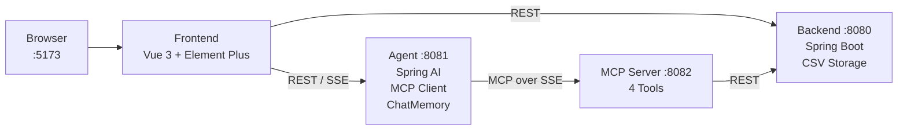
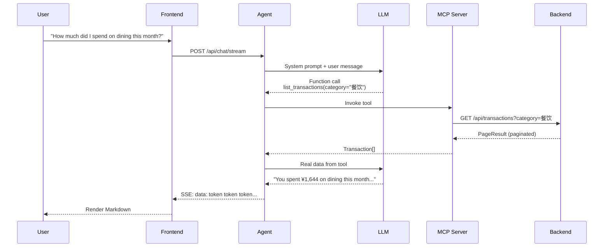
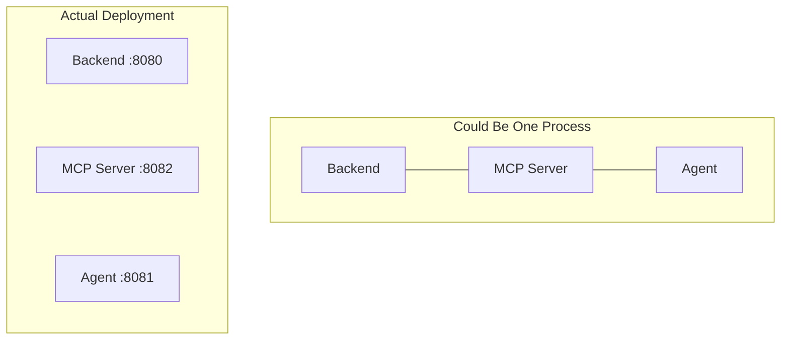

# Personal Finance Agent · AI 记账助手

[](https://opensource.org/licenses/MIT)
[](https://adoptium.net/)
[](https://spring.io/projects/spring-boot)
[](https://vuejs.org/)
[](https://element-plus.org/)

A learning demo exploring **AI Agent** and **MCP (Model Context Protocol)** on the Java/Spring ecosystem — a personal finance tracker you can chat with.

[中文](README.md) | English

---

## What Is This?

A 4-service project exploring how to build AI-driven applications on the JVM. Record your daily income and expenses, then query your data through natural language conversations. The AI understands your intent, calls the right API via MCP tool invocations, and returns formatted results — with streaming output and conversation memory.

**What you'll learn from this codebase:**
- How the MCP protocol bridges LLMs and business APIs
- How Spring AI integrates with OpenAI-compatible models
- How to implement token-by-token SSE streaming from LLM to browser
- How to organize clear boundaries in a multi-service Java project

---

## Architecture



**4 services, 1 protocol chain.** The frontend talks to both Backend (CRUD) and Agent (AI chat). When Agent needs data, it doesn't call Backend directly — it goes through MCP Server, which wraps Backend APIs as standard MCP tools.

---

## AI Conversation Flow

What happens when a user asks *"How much did I spend on dining this month?"*:



Core insight: **The LLM autonomously decides which tool to call.** No hardcoded intent matching. The system prompt tells the LLM what tools are available, and it decides when and how to use them — the essence of the Agent pattern.

---

## Why 4 Services?

You could stuff all the Java code into a single Spring Boot project. The split is intentional for learning:



**The split isn't about production best practices — it's about making each layer visible.**

| Service | Responsibility | Knows AI? | Knows Business? |
|---------|---------------|:---:|:---:|
| Backend | Pure REST API + CSV storage | No | Yes |
| MCP Server | Wraps REST as MCP tools | No | No (pure proxy) |
| Agent | MCP Client + LLM orchestration | Yes | No |
| Frontend | UI, talks to both Backend and Agent | No | No |

This separation makes the MCP layer **visible and tangible**. In a real system you'd merge MCP Server into Backend, but here you can clearly see where the protocol boundary lies.

---

## Design Decisions

**CSV instead of a database** — Zero environment dependencies. Clone, set your LLM key, and run. No MySQL, no Docker. CSV files are debuggable with any text editor.

**`.env` configuration** — One file for all LLM credentials. Spring Boot loads `.env` natively via a custom `PropertySourceLoader`, no manual `export` needed.

**SSE instead of WebSocket** — Agent streams tokens to the browser via Server-Sent Events. SSE is unidirectional (server→client), perfect for LLM streaming. Simpler than WebSocket, works through HTTP proxies.

**Multi-user via `userId` param** — A dropdown switches users, no real auth. But every API call and MCP tool invocation carries a `userId`, demonstrating multi-tenant data isolation without OAuth ceremony.

---

## Quick Start

**Requirements:** Java 17+, Node.js 18+

```bash
# 1. Clone
git clone https://github.com/your-username/personal-finance-agent.git
cd personal-finance-agent

# 2. Configure LLM
cp .env.example .env
# Edit .env → add your API key

# 2b. Activate git hooks (commit format validation + auto-push)
git config core.hooksPath githooks

# 3. Install frontend dependencies
cd finance-frontend && npm install && cd ..

# 4. One-click start
./start-all.sh

# 5. Open http://localhost:5173
```

> **Tip:** If Maven compilation fails, check that `JAVA_HOME` points to JDK 17. `mvnw` defaults to your system Java — which may be Java 8.

**Manual start (4 terminal windows, easier for debugging):**

```bash
# T1: Backend
cd finance-backend && ./mvnw spring-boot:run

# T2: MCP Server
cd finance-mcp-server && ./mvnw spring-boot:run

# T3: Agent
cd finance-agent && ./mvnw spring-boot:run

# T4: Frontend
cd finance-frontend && npm run dev
```

---

## Project Map

```
.
├── finance-backend/         Spring Boot · REST API · Jackson CsvMapper
│   └── .../controller, service, repository, model
├── finance-mcp-server/      Spring AI MCP · @McpTool · SSE transport
│   └── .../tool/FinanceTools.java  ← 4 tools, 1 file
├── finance-agent/           Spring AI ChatClient · MCP Client · ChatMemory
│   └── .../controller/ChatController.java  ← /chat, /chat/stream
├── finance-frontend/        Vue 3 · Element Plus · ECharts · SSE streaming
│   └── src/components/      ← 7 components, 1 store
├── .env.example             LLM config template → copy to .env
└── start-all.sh             One-click start
```

Each module has its own `pom.xml` (Java) or `package.json` (frontend). They don't share code — communication is HTTP-only.

---

## AI Conversation Examples

```
You: What's my account balance?
AI: Your default cash account balance is ¥20,273.96.

You: How much did I spend on dining this month?
AI: You spent ¥1,644 on dining this month, across 26 transactions.

You: Record a transaction: lunch ¥50
AI: Recorded: expense ¥50.00, category: dining, note: lunch.
```

All queries go through the MCP tool chain. The AI never fabricates data — the system prompt requires it to always call tools for real data.

---

## Claude Desktop Integration

MCP Server exposes standard MCP protocol:

```json
{
  "mcpServers": {
    "finance": {
      "url": "http://localhost:8082/sse"
    }
  }
}
```

Add this to `claude_desktop_config.json` and Claude Desktop can directly query your finance data.

---

## FAQ

**Can I use other LLMs?** Yes. Edit `.env` to switch — any OpenAI-compatible API works (OpenAI, DeepSeek, Qwen, Groq, Moonshot, SiliconFlow, etc.).

**Port already in use?**
```bash
lsof -ti:8080 | xargs kill -9  # Backend
lsof -ti:8081 | xargs kill -9  # Agent
lsof -ti:8082 | xargs kill -9  # MCP Server
lsof -ti:5173 | xargs kill -9  # Frontend
```

**How to reset data?** `rm -rf finance-backend/data`

## License

MIT © 2026
