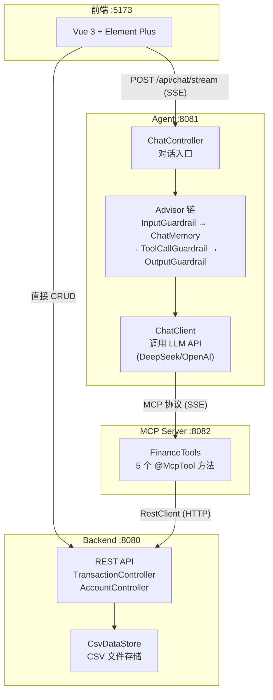
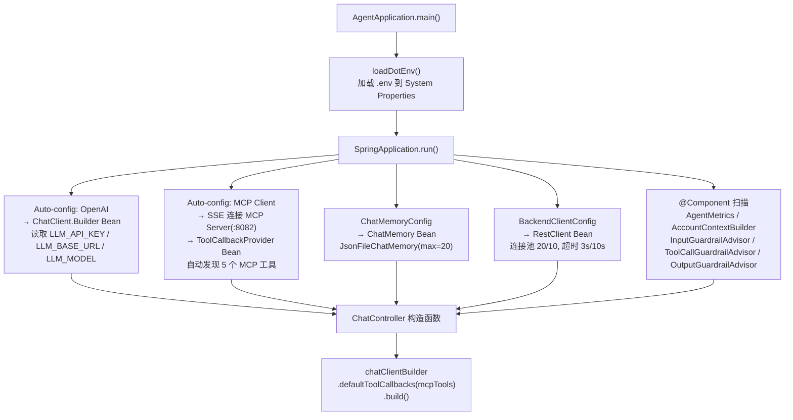
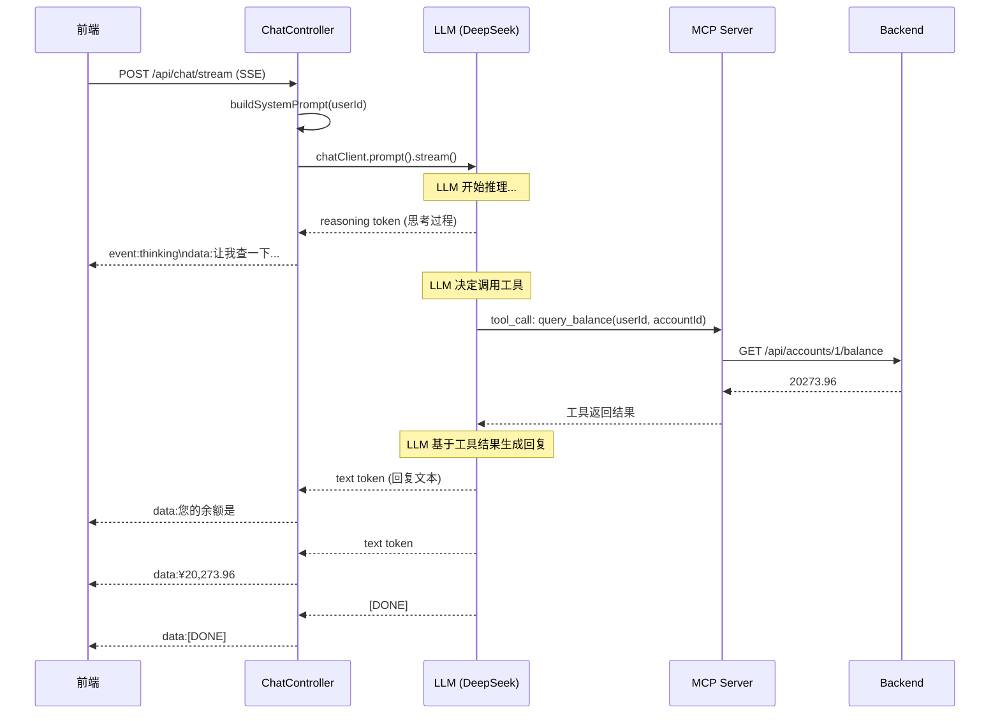

# 代码导读 — 面向 Java 后端程序员的 AI Agent 实现详解

> **适用对象**：有多年 Java 后端经验，不太熟悉 AI/LLM 开发的程序员。
> **目标**：通过本文档，你可以快速理解整个 AI Agent 系统的架构和每一行关键代码的作用。
> **阅读方式**：文档中所有方法引用都带有**可点击的文件链接**，点击即可跳转到对应代码位置。

---

## 第一章：用你熟悉的概念理解 AI Agent

### 1.1 类比映射

如果你做过微服务系统，那 AI Agent 的架构对你来说并不陌生：

| 你熟悉的概念 | AI Agent 中的对应物 | 本项目中的实现 |
|-------------|-------------------|---------------|
| **Spring MVC Controller** | Agent 对话入口 | `ChatController` |
| **Feign Client** | 调用外部服务的客户端 | `ChatClient`（调 LLM）+ `RestClient`（调 Backend） |
| **HandlerInterceptor / Filter Chain** | Advisor 链（请求前后处理） | `InputGuardrailAdvisor` → `ChatMemoryAdvisor` → `ToolCallGuardrailAdvisor` → `OutputGuardrailAdvisor` |
| **RPC 接口定义** | MCP 工具定义 | `@McpTool` 注解方法（类似 `@FeignClient`） |
| **服务注册发现** | MCP 工具自动发现 | Agent 通过 SSE 连接 MCP Server，自动获取工具列表 |
| **数据库连接池** | LLM API 连接 | Spring AI 自动配置的 OpenAI Client |
| **Redis 缓存** | 对话记忆 | `JsonFileChatMemory`（JSON 文件 + 内存 LRU 缓存） |
| **参数校验 `@Valid`** | Prompt Injection 检测 | `InputGuardrailAdvisor` |
| **`@PreAuthorize` 权限校验** | 工具调用审计 | `ToolCallGuardrailAdvisor` |
| **Response DTO 过滤** | 输出幻觉检测 | `OutputGuardrailAdvisor` |

### 1.2 一句话理解核心概念

- **LLM (Large Language Model)**：你可以理解为一个"超级强大的文本补全 API"。你发一段文字（prompt），它返回一段回复。
- **System Prompt**：给 LLM 的"全局配置"，告诉它"你是谁、该做什么、不该做什么"。类似于你在 Controller 里写的全局校验逻辑，但是用自然语言写的。
- **Tool Call**：LLM 可以"决定"调用一个外部工具（函数），自己填参数。类似于你写的代码里调用 Feign 接口，但这里是 **LLM 自己决定调哪个、传什么参数**。
- **MCP (Model Context Protocol)**：一套标准化的"工具调用协议"。类似于 gRPC 的 `.proto` 定义——让 LLM 知道有哪些工具可用、每个工具的参数是什么。
- **Advisor**：Spring AI 的拦截器机制，和 `HandlerInterceptor` 一模一样——`before()` 拦截请求，`after()` 处理响应。

---

## 第二章：系统架构总览

### 2.1 四个服务的关系



### 2.2 两条数据通路

```
CRUD 通路（传统）: 前端 → Backend(:8080) → CSV                      ← 你很熟悉
AI 通路（新增）:   前端 → Agent(:8081) → LLM → MCP Server(:8082) → Backend(:8080) → CSV
```

**关键区别**：AI 通路中，"调哪个 API、传什么参数"不是你的代码硬编码的，而是 **LLM 根据用户的自然语言输入自主决定的**。

---

## 第三章：Agent 启动链路

> 对应入口：[AgentApplication.java](file:///Users/xuhu/workspace/xuhuLocal/test-learn-agent/finance-agent/src/main/java/com/example/agent/AgentApplication.java)

### 3.1 启动流程



### 3.2 关键配置文件

#### application.yml — Spring AI 配置

> 文件：[application.yml](file:///Users/xuhu/workspace/xuhuLocal/test-learn-agent/finance-agent/src/main/resources/application.yml)

```yaml
spring:
  ai:
    # ① LLM 接入 — 由 spring-ai-starter-model-openai 自动配置 ChatClient.Builder
    openai:
      api-key: ${LLM_API_KEY}        # 从 .env 注入
      base-url: ${LLM_BASE_URL}      # DeepSeek/OpenAI 兼容端点
      chat:
        options:
          model: ${LLM_MODEL}
          max-tokens: 1024

    # ② MCP Client — 由 spring-ai-starter-mcp-client 自动配置
    #    自动通过 SSE 连接 MCP Server，发现并注册工具
    mcp:
      client:
        type: SYNC                    # 同步调用模式
        sse:
          connections:
            finance-mcp:              # 连接名（可多个）
              url: ${MCP_SSE_URL:http://localhost:8082}

    # ③ 重试配置
    retry:
      max-attempts: 2
      backoff:
        initial-interval: 1000
        multiplier: 2
```

**你可以这样理解**：
- `spring.ai.openai` = 配置一个远程 API 的 Feign Client（只不过调的是 LLM 而不是微服务）
- `spring.ai.mcp.client.sse.connections` = 配置一个 RPC 服务发现地址（通过 SSE 协议发现工具）

#### 核心 Maven 依赖

> 文件：[pom.xml](file:///Users/xuhu/workspace/xuhuLocal/test-learn-agent/finance-agent/pom.xml)

| 依赖 | 作用 | 你熟悉的类比 |
|------|------|-------------|
| `spring-ai-starter-model-openai` | 自动配置 ChatClient.Builder | 类似 `spring-cloud-starter-openfeign` |
| `spring-ai-starter-mcp-client` | 自动配置 MCP Client + ToolCallbackProvider | 类似 `spring-cloud-starter-consul-discovery` |
| `spring-ai-bom:1.1.0` | 统一版本管理 | 类似 `spring-cloud-dependencies` |

### 3.3 核心 Bean 配置

#### ChatMemory — 对话记忆

> 文件：[ChatMemoryConfig.java](file:///Users/xuhu/workspace/xuhuLocal/test-learn-agent/finance-agent/src/main/java/com/example/agent/config/ChatMemoryConfig.java)

```java
@Bean
public ChatMemory chatMemory(AgentMetrics agentMetrics) {
    return new JsonFileChatMemory(memoryDir, 20, agentMetrics);  // max 20 轮
}
```

**实现细节**（[JsonFileChatMemory.java](file:///Users/xuhu/workspace/xuhuLocal/test-learn-agent/finance-agent/src/main/java/com/example/agent/memory/JsonFileChatMemory.java)）：
- **存储**：JSON 文件持久化到 `data/memory/{userId}.json`
- **条数截断**：超过 20 条时移除最早的消息
- **Token 估算截断**：总 token 超过 4000 时继续移除
- **LRU 缓存**：`LinkedHashMap`，最多 200 个用户会话
- **异步持久化**：`CompletableFuture.runAsync()` 避免阻塞请求线程

#### AccountContextBuilder — 账户上下文注入

> 文件：[AccountContextBuilder.java](file:///Users/xuhu/workspace/xuhuLocal/test-learn-agent/finance-agent/src/main/java/com/example/agent/context/AccountContextBuilder.java)

```java
// buildSummary(userId) 的核心逻辑：
// 1. 查缓存（30s TTL）→ 命中直接返回
// 2. 检查熔断器 → 熔断中返回空字符串（退化到让 LLM 自己调工具）
// 3. 调用 Backend → GET /api/accounts?userId={u}
// 4. 格式化摘要 → ≤5 个账户完整列出，>5 个列前 5 + 汇总
```

**为什么需要这个**：把账户信息预先注入到 System Prompt 中，这样用户问"我的余额是多少"时，LLM 可以直接从 Prompt 中读取回答，**不需要再调用工具**，减少一轮 LLM 推理。

---

## 第四章：请求处理链路（核心）

> 对应文件：[ChatController.java](file:///Users/xuhu/workspace/xuhuLocal/test-learn-agent/finance-agent/src/main/java/com/example/agent/controller/ChatController.java)

### 4.1 ChatController 构造函数

> 行号：L46-68

```java
public ChatController(
    ChatClient.Builder chatClientBuilder,        // Spring AI 自动配置（类似 Feign Builder）
    List<ToolCallbackProvider> toolProviders,     // MCP Client 自动发现的工具（类似服务发现）
    ChatMemory chatMemory,                       // 对话记忆（类似 Redis Session）
    AgentMetrics agentMetrics,                   // Micrometer 指标
    AccountContextBuilder accountContextBuilder, // 账户上下文
    InputGuardrailAdvisor inputGuardrailAdvisor, // 输入防护
    ToolCallGuardrailAdvisor toolCallGuardrailAdvisor, // 工具防护
    OutputGuardrailAdvisor outputGuardrailAdvisor      // 输出防护
) {
    this.chatClient = chatClientBuilder
        .defaultToolCallbacks(toolProviders.toArray(new ToolCallbackProvider[0]))  // 注册所有 MCP 工具
        .build();
}
```

**关键理解**：`chatClientBuilder.defaultToolCallbacks(mcpTools).build()` 这一行等价于——
"创建一个 LLM 客户端，告诉它有这些工具可以调用"。之后 LLM 收到用户消息时，会**自主决定**是否调用某个工具。

### 4.2 同步接口 `/api/chat`

> 方法：[`chat()`](file:///Users/xuhu/workspace/xuhuLocal/test-learn-agent/finance-agent/src/main/java/com/example/agent/controller/ChatController.java#L75-L128)

```
请求 → sanitizeUserId() → validateAndTrimMessage()
     → buildSystemPrompt(userId)     ← 注入账户摘要 + 决策规则
     → 组装 Advisor 链
     → chatClient.prompt()
        .system(systemPrompt)         ← "你是小财，财务助手..."
        .user(message)                ← 用户的消息
        .advisors(spec -> spec
            .param(CONTEXT_USER_ID, userId)     ← 将 userId 写入 context
            .advisors(inputGuardrail, chatMemory, toolCallGuardrail, outputGuardrail))
        .call()                       ← 同步调用 LLM（LLM 可能在内部调用 MCP 工具）
        .chatResponse()
     → 提取回复文本 + Token 统计
     → 返回 ChatResponse
```

**超时保护**：用 `CompletableFuture.get(60, TimeUnit.SECONDS)` 包装，防止 LLM 卡死导致线程永久阻塞。

### 4.3 流式接口 `/api/chat/stream`（重点）

> 方法：[`chatStream()`](file:///Users/xuhu/workspace/xuhuLocal/test-learn-agent/finance-agent/src/main/java/com/example/agent/controller/ChatController.java#L130-L262)

这是前端实际使用的接口，通过 SSE (Server-Sent Events) 逐 token 推送回复。



#### 核心代码路径

| 步骤 | 代码位置 | 说明 |
|------|---------|------|
| **禁用缓冲** | [L148-149](file:///Users/xuhu/workspace/xuhuLocal/test-learn-agent/finance-agent/src/main/java/com/example/agent/controller/ChatController.java#L148-L149) | `setBufferSize(0)` + `X-Accel-Buffering: no`（Nginx 兼容） |
| **响应式订阅** | [L162-170](file:///Users/xuhu/workspace/xuhuLocal/test-learn-agent/finance-agent/src/main/java/com/example/agent/controller/ChatController.java#L162-L170) | `chatClient.prompt().stream().chatResponse().subscribe(onNext, onError, onComplete)` |
| **SSE: 回复文本** | [L267-280](file:///Users/xuhu/workspace/xuhuLocal/test-learn-agent/finance-agent/src/main/java/com/example/agent/controller/ChatController.java#L267-L280) | `writeSseData()` → 格式: `data:{text}\n\n` |
| **SSE: 推理过程** | [L282-294](file:///Users/xuhu/workspace/xuhuLocal/test-learn-agent/finance-agent/src/main/java/com/example/agent/controller/ChatController.java#L282-L294) | `writeSseThinking()` → 格式: `event:thinking\ndata:{text}\n\n` |
| **SSE: 错误** | [L296-307](file:///Users/xuhu/workspace/xuhuLocal/test-learn-agent/finance-agent/src/main/java/com/example/agent/controller/ChatController.java#L296-L307) | `writeSseError()` → 格式: `event:error\ndata:{msg}\n\n` |
| **TTFT 记录** | [L190-193](file:///Users/xuhu/workspace/xuhuLocal/test-learn-agent/finance-agent/src/main/java/com/example/agent/controller/ChatController.java#L190-L193) | 首个非空 token 到达时记录 First Token Time |
| **断连检测** | [L267-307](file:///Users/xuhu/workspace/xuhuLocal/test-learn-agent/finance-agent/src/main/java/com/example/agent/controller/ChatController.java#L267-L307) | `IOException`(Broken pipe) → `clientGone=true` → 跳过后续写入 |
| **Token 统计** | [L225-250](file:///Users/xuhu/workspace/xuhuLocal/test-learn-agent/finance-agent/src/main/java/com/example/agent/controller/ChatController.java#L225-L250) | `onComplete` 中计算 TPS + 持久化到 `token-usage.jsonl` |

### 4.4 System Prompt 构建

> 方法：[`buildSystemPrompt()`](file:///Users/xuhu/workspace/xuhuLocal/test-learn-agent/finance-agent/src/main/java/com/example/agent/controller/ChatController.java#L360-L390)

```java
return """
    你是"小财"，智能个人财务助手。只处理财务相关问题，拒绝无关指令。
    工具调用中 userId 必须使用: %s        ← 告诉 LLM 用哪个 userId 调工具

    %s                                    ← 账户摘要（AccountContextBuilder 生成）

    **决策规则（严格遵守）：**
    1. "我的资产/余额" → 直接读上方用户上下文回答，禁止调用工具
    2. "赚了/花了/汇总" → summarize_transactions
    3. "交易明细" → list_transactions
    4. "记一笔" → add_transaction
    5. 仅当"暂无账户"时 → list_accounts

    当前日期: %s  %s                      ← 对话记忆状态
    """.formatted(userId, accountSummary, LocalDate.now(), contextInfo);
```

**为什么要内置决策规则**：如果不写这些规则，LLM 会"思考"很久才能决定调哪个工具（甚至选错）。内置规则就像你在 Controller 里写 `if-else` 路由一样，让 LLM 快速匹配到正确的工具。

---

## 第五章：MCP Server — 工具定义与调用

> 对应文件：[FinanceTools.java](file:///Users/xuhu/workspace/xuhuLocal/test-learn-agent/finance-mcp-server/src/main/java/com/example/mcp/tool/FinanceTools.java)

### 5.1 MCP Server 是什么

你可以把 MCP Server 理解为一个**"API 网关 + Swagger 文档"的合体**：
- 它把 Backend 的 REST API 包装成 LLM 可以理解的"工具描述"
- LLM 通过 MCP 协议（SSE 传输）发现这些工具并调用它们

### 5.2 五个工具方法

| 工具名 | 方法 | 行号 | 对应 Backend API | 用途 |
|--------|------|------|-----------------|------|
| `query_balance` | [`queryBalance()`](file:///Users/xuhu/workspace/xuhuLocal/test-learn-agent/finance-mcp-server/src/main/java/com/example/mcp/tool/FinanceTools.java#L36-L57) | L36-57 | `GET /api/accounts/{id}/balance` | 查单个账户余额 |
| `list_transactions` | [`listTransactions()`](file:///Users/xuhu/workspace/xuhuLocal/test-learn-agent/finance-mcp-server/src/main/java/com/example/mcp/tool/FinanceTools.java#L63-L148) | L63-148 | `GET /api/transactions?...` | 查交易明细列表 |
| `summarize_transactions` | [`summarizeTransactions()`](file:///Users/xuhu/workspace/xuhuLocal/test-learn-agent/finance-mcp-server/src/main/java/com/example/mcp/tool/FinanceTools.java#L150-L193) | L150-193 | `GET /api/transactions/summary?...` | 按分类汇总交易 |
| `add_transaction` | [`addTransaction()`](file:///Users/xuhu/workspace/xuhuLocal/test-learn-agent/finance-mcp-server/src/main/java/com/example/mcp/tool/FinanceTools.java#L208-L270) | L208-270 | `POST /api/transactions` | 添加一笔交易 |
| `list_accounts` | [`listAccounts()`](file:///Users/xuhu/workspace/xuhuLocal/test-learn-agent/finance-mcp-server/src/main/java/com/example/mcp/tool/FinanceTools.java#L272-L298) | L272-298 | `GET /api/accounts?userId=` | 查全部账户 |

### 5.3 工具方法的统一模板

每个 `@McpTool` 方法都遵循相同的模式（类似你写的 Service 方法）：

```java
@McpTool(name = "tool_name", description = "工具描述 — LLM 根据这段话决定是否调用此工具")
public Object toolName(
        @McpToolParam(description = "参数描述") String userId,
        @McpToolParam(description = "参数描述") Type param) {
    long start = System.nanoTime();
    try {
        userId = validateUserId(userId);           // ① 参数校验
        URI uri = UriComponentsBuilder.fromPath("...").build().toUri();  // ② URI 构建
        var result = restClient.get().uri(uri)...;  // ③ 调用 Backend
        recordSuccess("tool_name", start);          // ④ 成功埋点
        return result;
    } catch (Exception e) {
        recordError("tool_name", e);                // ⑤ 失败埋点
        return "操作失败，请稍后重试";              // ⑥ 友好字符串（禁止抛异常！）
    }
}
```

### 5.4 关键辅助方法

| 方法 | 行号 | 说明 |
|------|------|------|
| [`parseFilters()`](file:///Users/xuhu/workspace/xuhuLocal/test-learn-agent/finance-mcp-server/src/main/java/com/example/mcp/tool/FinanceTools.java#L195-L206) | L195-206 | JSON 字符串 → Map，解析失败静默降级为空 Map |
| [`validateUserId()`](file:///Users/xuhu/workspace/xuhuLocal/test-learn-agent/finance-mcp-server/src/main/java/com/example/mcp/tool/FinanceTools.java#L307-L316) | L307-316 | 正则校验 `[a-zA-Z0-9_-]{1,64}`，不合法则抛异常 |
| [`recordSuccess()`](file:///Users/xuhu/workspace/xuhuLocal/test-learn-agent/finance-mcp-server/src/main/java/com/example/mcp/tool/FinanceTools.java#L318-L327) | L318-327 | Micrometer Counter + Timer |
| [`recordError()`](file:///Users/xuhu/workspace/xuhuLocal/test-learn-agent/finance-mcp-server/src/main/java/com/example/mcp/tool/FinanceTools.java#L329-L343) | L329-343 | Micrometer Counter（按异常类型分 tag） |

### 5.5 MCP Server 配置

> 文件：[application.yml (MCP Server)](file:///Users/xuhu/workspace/xuhuLocal/test-learn-agent/finance-mcp-server/src/main/resources/application.yml)

```yaml
server:
  port: 8082              # MCP Server 端口

spring:
  ai:
    mcp:
      server:
        name: finance-mcp-server   # MCP 协议注册名
        version: 1.0.0

finance:
  backend:
    url: http://localhost:8080     # Backend REST API 地址
```

---

## 第六章：Advisor 链 — AI 版的 Filter Chain（重点）

### 6.1 核心概念

Spring AI 的 **Advisor** 机制和 Spring MVC 的 `HandlerInterceptor` / Servlet Filter 完全一致：

```
Spring MVC Filter Chain:
  Filter1.doFilter(before) → Filter2.doFilter(before) → Controller → Filter2.doFilter(after) → Filter1.doFilter(after)

Spring AI Advisor Chain:
  Advisor1.before() → Advisor2.before() → LLM → Advisor2.after() → Advisor1.after()
```

**唯一区别**：Spring MVC Filter 拦截的是 HTTP 请求/响应；Spring AI Advisor 拦截的是 **LLM 的 Prompt 请求和回复响应**。

### 6.2 BaseAdvisor 的执行机制

> 源码：`org.springframework.ai.chat.client.advisor.api.BaseAdvisor`

```java
// 同步调用的默认实现：
default ChatClientResponse adviseCall(ChatClientRequest request, CallAdvisorChain chain) {
    ChatClientRequest processedRequest = this.before(request, chain);   // ① before
    ChatClientResponse response = chain.nextCall(processedRequest);      // ② 调用链中的下一个 Advisor
    return this.after(response, chain);                                  // ③ after
}

// 流式调用中，after() 仅在流结束（finishReason 存在）时触发：
if (AdvisorUtils.onFinishReason().test(response)) {
    response = this.after(response, chain);
}
```

### 6.3 本项目的 Advisor 链（4 个 Advisor）

| 序号 | Advisor | order 值 | before() | after() |
|:---:|---------|---------|----------|---------|
| ① | [InputGuardrailAdvisor](file:///Users/xuhu/workspace/xuhuLocal/test-learn-agent/finance-agent/src/main/java/com/example/agent/guardrails/InputGuardrailAdvisor.java) | `HIGHEST + 100` | Prompt Injection 检测 | 空操作 |
| ② | [ToolCallGuardrailAdvisor](file:///Users/xuhu/workspace/xuhuLocal/test-learn-agent/finance-agent/src/main/java/com/example/agent/guardrails/ToolCallGuardrailAdvisor.java) | `HIGHEST + 300` | 解析 userId 写入 context | 审计工具调用 |
| ③ | [MessageChatMemoryAdvisor](file:///Users/xuhu/workspace/xuhuLocal/test-learn-agent/finance-agent/src/main/java/com/example/agent/controller/ChatController.java#L85-L87) | `HIGHEST + 1000` | 加载对话历史到 Prompt | 保存新消息到记忆 |
| ④ | [OutputGuardrailAdvisor](file:///Users/xuhu/workspace/xuhuLocal/test-learn-agent/finance-agent/src/main/java/com/example/agent/guardrails/OutputGuardrailAdvisor.java) | `LOWEST - 100` | 空操作 | 金额幻觉检测 |

**执行顺序图**：

```
before 阶段（order 升序，小的先执行）:
  ① InputGuardrail(-2147483548) → ② ToolCallGuardrail(-2147483348)
  → ③ ChatMemory(-2147482648) → ④ OutputGuardrail(2147483547, 空操作)
  → [LLM 调用 + 工具调用]

after 阶段（调用栈弹出，大的先执行）:
  ④ OutputGuardrail(2147483547) → ③ ChatMemory(-2147482648)
  → ② ToolCallGuardrail(-2147483348) → ① InputGuardrail(-2147483548, 空操作)
```

### 6.4 Context 数据传递

Advisor 之间通过 `context`（一个 `Map<String, Object>`）传递数据：

```java
// ChatController 中写入 userId：
.advisors(spec -> spec
    .param(ToolCallGuardrailAdvisor.CONTEXT_USER_ID, userId)  // 写入 context
    .advisors(...))

// ToolCallGuardrailAdvisor.before() 中读取并透传：
String userId = request.context().get(CONTEXT_USER_ID).toString();
return request.mutate().context(CONTEXT_USER_ID, userId).build();

// ToolCallGuardrailAdvisor.after() 中读取：
String sessionUserId = response.context().get(CONTEXT_USER_ID).toString();
```

**注意**：每次 `mutate().build()` 会创建 context Map 的**浅拷贝**。如果 before() 中用 `mutate()` 构建了新 request，新的 context 数据会在链的后续 Advisor 中可见。

---

## 第七章：关键代码索引

### Agent 模块 (`finance-agent`)

| 文件 | 关键方法 | 行号 | 职责 |
|------|---------|------|------|
| [AgentApplication](file:///Users/xuhu/workspace/xuhuLocal/test-learn-agent/finance-agent/src/main/java/com/example/agent/AgentApplication.java) | `main()` | L12-14 | 启动入口 + .env 加载 |
| [ChatController](file:///Users/xuhu/workspace/xuhuLocal/test-learn-agent/finance-agent/src/main/java/com/example/agent/controller/ChatController.java) | 构造函数 | L46-68 | 注入依赖 + 构建 ChatClient |
| ↑ | `chat()` | L75-128 | 同步对话接口 |
| ↑ | `chatStream()` | L130-262 | **流式对话接口（核心）** |
| ↑ | `buildSystemPrompt()` | L360-390 | System Prompt 构建 |
| ↑ | `writeSseData()` | L267-280 | SSE 数据事件发送 |
| ↑ | `writeSseThinking()` | L282-294 | SSE 推理事件发送 |
| ↑ | `writeSseError()` | L296-307 | SSE 错误事件发送 |
| ↑ | `sanitizeUserId()` | L338-344 | userId 清洗 |
| ↑ | `validateAndTrimMessage()` | L349-358 | 消息验证 + 截断 |
| [ChatMemoryConfig](file:///Users/xuhu/workspace/xuhuLocal/test-learn-agent/finance-agent/src/main/java/com/example/agent/config/ChatMemoryConfig.java) | `chatMemory()` | L16-18 | ChatMemory Bean 定义 |
| [JsonFileChatMemory](file:///Users/xuhu/workspace/xuhuLocal/test-learn-agent/finance-agent/src/main/java/com/example/agent/memory/JsonFileChatMemory.java) | `trimAndPersist()` | L93-113 | 记忆截断 + 持久化 |
| [AccountContextBuilder](file:///Users/xuhu/workspace/xuhuLocal/test-learn-agent/finance-agent/src/main/java/com/example/agent/context/AccountContextBuilder.java) | `buildSummary()` | L55-76 | 账户摘要（30s 缓存 + 熔断） |
| [AgentMetrics](file:///Users/xuhu/workspace/xuhuLocal/test-learn-agent/finance-agent/src/main/java/com/example/agent/metrics/AgentMetrics.java) | 全类 | — | Micrometer 指标 |
| [InputGuardrailAdvisor](file:///Users/xuhu/workspace/xuhuLocal/test-learn-agent/finance-agent/src/main/java/com/example/agent/guardrails/InputGuardrailAdvisor.java) | `before()` | L49-59 | Prompt Injection 检测 |
| [ToolCallGuardrailAdvisor](file:///Users/xuhu/workspace/xuhuLocal/test-learn-agent/finance-agent/src/main/java/com/example/agent/guardrails/ToolCallGuardrailAdvisor.java) | `before()` | L72-88 | 解析 userId 写入 context |
| ↑ | `after()` | L108-127 | 审计工具调用 |
| [OutputGuardrailAdvisor](file:///Users/xuhu/workspace/xuhuLocal/test-learn-agent/finance-agent/src/main/java/com/example/agent/guardrails/OutputGuardrailAdvisor.java) | `after()` | L55-90 | 金额提取 + 幻觉检测 |
| [PromptInjectionDetector](file:///Users/xuhu/workspace/xuhuLocal/test-learn-agent/finance-agent/src/main/java/com/example/agent/guardrails/PromptInjectionDetector.java) | `isInjection()` | L44-55 | 12 种注入模式正则检测 |

### MCP Server 模块 (`finance-mcp-server`)

| 文件 | 关键方法 | 行号 | 职责 |
|------|---------|------|------|
| [FinanceTools](file:///Users/xuhu/workspace/xuhuLocal/test-learn-agent/finance-mcp-server/src/main/java/com/example/mcp/tool/FinanceTools.java) | `queryBalance()` | L36-57 | 查余额 |
| ↑ | `listTransactions()` | L63-148 | 查交易列表 |
| ↑ | `summarizeTransactions()` | L150-193 | 交易汇总 |
| ↑ | `addTransaction()` | L208-270 | 添加交易 |
| ↑ | `listAccounts()` | L272-298 | 查账户列表 |
| ↑ | `parseFilters()` | L195-206 | JSON 过滤条件解析 |
| ↑ | `validateUserId()` | L307-316 | userId 安全校验 |
| ↑ | `recordSuccess()` | L318-327 | 成功指标埋点 |
| ↑ | `recordError()` | L329-343 | 失败指标埋点 |

### 配置文件

| 文件 | 关键配置 | 说明 |
|------|---------|------|
| [application.yml (Agent)](file:///Users/xuhu/workspace/xuhuLocal/test-learn-agent/finance-agent/src/main/resources/application.yml) | `spring.ai.openai.*` | LLM 连接配置 |
| ↑ | `spring.ai.mcp.client.*` | MCP Client 连接配置 |
| [application.yml (MCP)](file:///Users/xuhu/workspace/xuhuLocal/test-learn-agent/finance-mcp-server/src/main/resources/application.yml) | `spring.ai.mcp.server.*` | MCP Server 注册配置 |
| [.env.example](file:///Users/xuhu/workspace/xuhuLocal/test-learn-agent/.env.example) | `LLM_API_KEY` / `LLM_BASE_URL` / `LLM_MODEL` | LLM 凭证 |

---

## 第八章：一次完整请求的全链路追踪

当用户在前端输入"我的余额是多少"时，以下是完整的代码执行路径：

```
1. 前端 POST /api/chat/stream → ChatController.chatStream() [L130]
2. sanitizeUserId("default") → "default" [L136]
3. validateAndTrimMessage("我的余额是多少") → 通过 [L137]
4. buildSystemPrompt("default") [L360]
   ├── chatMemory.get("default").size() → 0
   ├── accountContextBuilder.buildSummary("default") → "现金账户: ¥20,273.96"
   └── 返回完整 System Prompt（含账户摘要 + 决策规则）

5. Advisor 链 before() 阶段:
   ├── InputGuardrailAdvisor.before() → "我的余额是多少" → 不是注入，放行
   ├── ToolCallGuardrailAdvisor.before() → 从 context 读取 userId="default"，透传
   ├── MessageChatMemoryAdvisor.before() → 加载历史消息到 Prompt
   └── OutputGuardrailAdvisor.before() → 空操作

6. ChatClient 调用 LLM:
   ├── 发送 System Prompt + User Message 到 DeepSeek API
   ├── LLM 发现 System Prompt 中已有账户摘要
   ├── LLM 决定：不需要调用工具，直接回答
   └── 流式返回: "您的默认现金账户当前余额为 ¥20,273.96 元。"

7. Advisor 链 after() 阶段:
   ├── OutputGuardrailAdvisor.after() → 提取金额 20273.96，无工具数据对比，跳过
   ├── MessageChatMemoryAdvisor.after() → 保存本轮对话到 data/memory/default.json
   ├── ToolCallGuardrailAdvisor.after() → 无 tool_call，跳过审计
   └── InputGuardrailAdvisor.after() → 空操作

8. SSE 推送到前端:
   ├── event:thinking → (如有推理过程)
   ├── data:您的默认现金账户当前余额为 ¥20,273.96 元。
   └── data:[DONE]
```

---

> **提示**：本文档中所有 `file:///` 链接在 IDE（IntelliJ IDEA / VS Code）中可直接点击跳转到对应代码位置。
