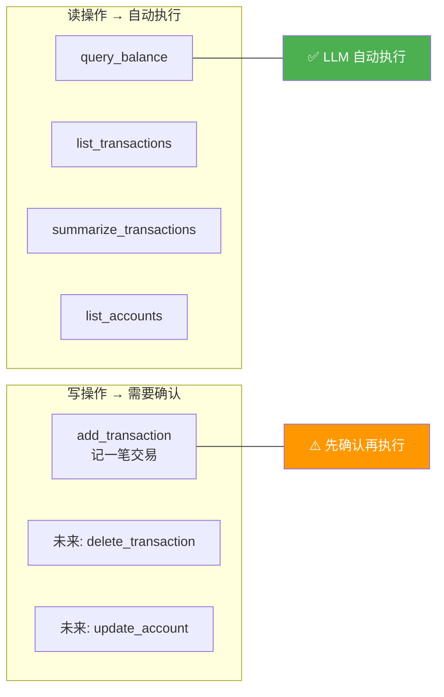
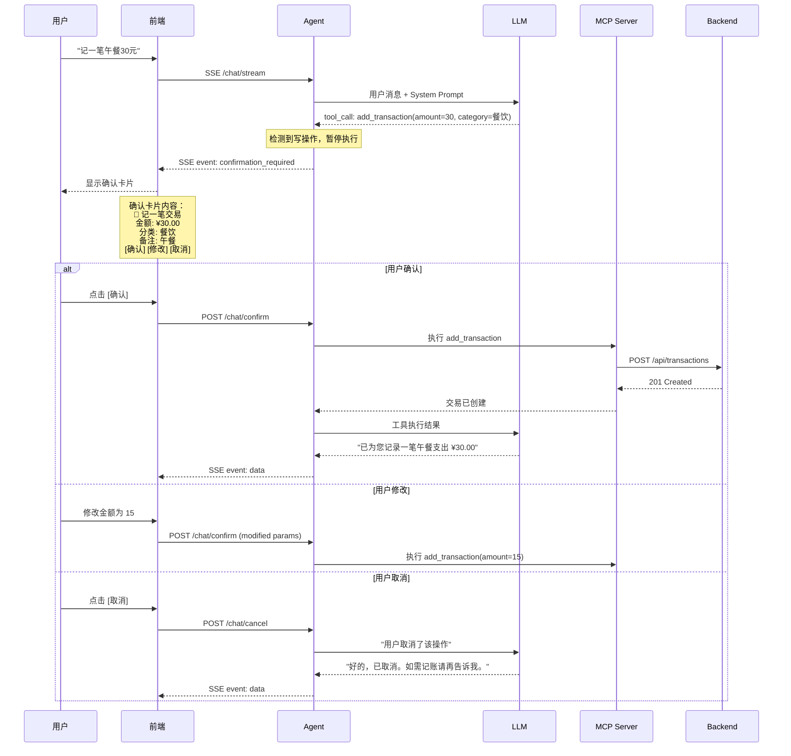
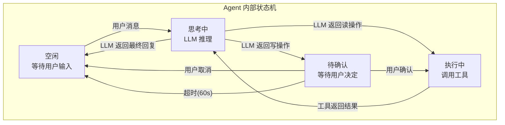
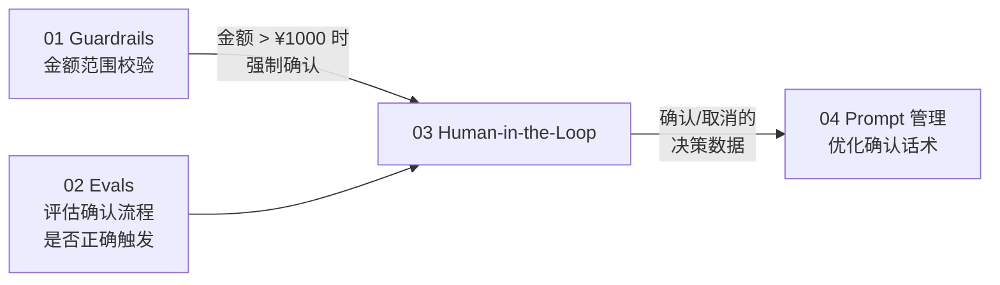

# 03 Human-in-the-Loop — 大额操作先确认再执行

> **优先级：★★★★☆**
> **一句话理解：Human-in-the-Loop 就是 AI 版的"二次确认弹窗"——重要操作先问人再做。**

---

## 用 Java 后端的经验来理解

你做过的系统里，一定有类似的设计：

| 场景 | 实现方式 |
|------|---------|
| 删除订单前弹确认框 | 前端 `confirm()` |
| 大额转账需要短信验证码 | 后端二次校验 |
| 审批流：提交 → 主管审批 → 执行 | 工作流引擎 |
| 数据库危险操作需 DBA 审批 | 运维审批系统 |

**Human-in-the-Loop 就是同样的思路，应用在 AI Agent 上：**

```
当前模式：
  用户说"记一笔5000元支出" → LLM 直接调用 add_transaction → 完成

HITL 模式：
  用户说"记一笔5000元支出" → LLM 准备调用 add_transaction
                             → 先返回确认卡片给用户
                             → 用户点"确认" → 执行
                             → 用户点"取消" → 不执行
```

---

## 为什么需要 Human-in-the-Loop？

### 问题 1：AI 理解错了但直接执行了

用户说"记一笔午餐"，LLM 猜测金额是 ¥30。但用户实际午餐花了 ¥15。因为没有确认环节，¥30 直接入库了。

### 问题 2：写操作不可逆（你的项目没有 DELETE API）

你的 Backend 目前**没有删除交易的 API**。一旦 `add_transaction` 执行了，用户无法撤销。这让确认环节更加重要。

### 问题 3：生产系统的合规要求

在真实的金融系统中，任何金额操作都需要用户明确授权。这不是"最好有"，而是"必须有"。

### 哪些操作需要确认？



**原则：读操作自动执行，写操作先确认。** 和你做后端 API 时区分 GET/POST 的思路一样。

---

## 架构设计

### 交互流程



### 数据流设计



### SSE 事件扩展

当前你的 SSE 支持 3 种事件类型，需要新增 1 种：

| 事件类型 | 用途 | 状态 |
|---------|------|:----:|
| `data` | LLM 回复文本 | 已有 ✅ |
| `thinking` | LLM 推理过程 | 已有 ✅ |
| `error` | 错误信息 | 已有 ✅ |
| **`confirmation`** | **写操作确认请求** | **新增** |

确认事件的 payload：

```json
{
  "event": "confirmation",
  "data": {
    "confirmationId": "uuid-xxx",
    "toolName": "add_transaction",
    "description": "记一笔交易",
    "parameters": {
      "accountId": 1,
      "type": "EXPENSE",
      "amount": 30.00,
      "category": "餐饮",
      "subCategory": "外卖",
      "note": "午餐"
    },
    "expiresAt": "2026-05-27T16:45:00Z"
  }
}
```

---

## 具体实现方案

### Java 侧 (Spring AI)

#### 1. 拦截写操作的 Advisor

```java
public class HumanConfirmationAdvisor implements CallAroundAdvisor {

    private static final Set<String> WRITE_TOOLS = Set.of(
        "add_transaction"
        // 未来: "delete_transaction", "update_account"
    );

    private final PendingConfirmationStore pendingStore;

    @Override
    public AdvisedResponse aroundCall(AdvisedRequest request, CallAroundAdvisorChain chain) {
        AdvisedResponse response = chain.nextAroundCall(request);

        // 检查 LLM 是否决定调用写操作工具
        List<ToolCall> toolCalls = response.getToolCalls();
        for (ToolCall toolCall : toolCalls) {
            if (WRITE_TOOLS.contains(toolCall.getName())) {
                // 暂停执行，生成确认请求
                String confirmationId = UUID.randomUUID().toString();
                pendingStore.save(confirmationId, toolCall, Duration.ofSeconds(60));

                // 返回确认事件而非执行结果
                return AdvisedResponse.builder()
                    .withConfirmationRequired(confirmationId, toolCall)
                    .build();
            }
        }
        return response;
    }
}
```

#### 2. 确认/取消端点

```java
@RestController
@RequestMapping("/chat")
public class ChatController {

    // 已有
    @GetMapping("/stream")
    public SseEmitter stream(@RequestParam String message, @RequestParam String userId) { ... }

    // 新增：确认执行
    @PostMapping("/confirm")
    public SseEmitter confirm(
            @RequestParam String confirmationId,
            @RequestBody(required = false) Map<String, Object> modifiedParams) {
        PendingToolCall pending = pendingStore.get(confirmationId);
        if (pending == null) {
            throw new IllegalArgumentException("确认请求已过期或不存在");
        }
        // 如果用户修改了参数，合并修改
        if (modifiedParams != null) {
            pending.mergeParams(modifiedParams);
        }
        // 执行工具调用并返回结果
        return executeAndStream(pending);
    }

    // 新增：取消操作
    @PostMapping("/cancel")
    public ResponseEntity<Void> cancel(@RequestParam String confirmationId) {
        pendingStore.remove(confirmationId);
        return ResponseEntity.ok().build();
    }
}
```

### Python 侧 (LangGraph)

LangGraph 天然支持 Human-in-the-Loop，通过 `interrupt()` 函数：

```python
from langgraph.types import interrupt, Command

def tool_executor(state):
    tool_call = state["pending_tool_call"]

    if tool_call["name"] in WRITE_TOOLS:
        # 暂停执行，等待用户确认
        user_decision = interrupt({
            "type": "confirmation_required",
            "tool_name": tool_call["name"],
            "parameters": tool_call["parameters"],
            "description": f"即将执行: {tool_call['name']}"
        })

        if user_decision["action"] == "cancel":
            return {"messages": [AIMessage(content="好的，已取消操作。")]}

        if user_decision.get("modified_params"):
            tool_call["parameters"].update(user_decision["modified_params"])

    # 执行工具调用
    result = execute_tool(tool_call)
    return {"messages": [ToolMessage(content=result)]}
```

### 前端确认卡片组件

```vue
<!-- ConfirmationCard.vue -->
<template>
  <div class="confirmation-card">
    <div class="card-header">
      <el-icon><Warning /></el-icon>
      <span>操作确认</span>
    </div>
    <div class="card-body">
      <p class="description">{{ confirmation.description }}</p>
      <el-descriptions :column="1" border size="small">
        <el-descriptions-item label="金额">
          ¥{{ confirmation.parameters.amount }}
        </el-descriptions-item>
        <el-descriptions-item label="分类">
          {{ confirmation.parameters.category }}
        </el-descriptions-item>
        <el-descriptions-item label="备注">
          {{ confirmation.parameters.note }}
        </el-descriptions-item>
      </el-descriptions>
    </div>
    <div class="card-actions">
      <el-button type="primary" @click="$emit('confirm')">确认执行</el-button>
      <el-button @click="$emit('modify')">修改</el-button>
      <el-button type="danger" plain @click="$emit('cancel')">取消</el-button>
    </div>
    <div class="expires">
      {{ remainingSeconds }}s 后自动取消
    </div>
  </div>
</template>
```

---

## 投入产出分析

### 投入

| 项目 | 估计工时 | 复杂度 |
|------|:-------:|:------:|
| PendingConfirmationStore（暂存待确认操作） | 2h | 低 |
| HumanConfirmationAdvisor（Java） | 4h | 中 |
| confirm/cancel API 端点 | 2h | 低 |
| Python interrupt() 集成 | 3h | 中 |
| SSE confirmation 事件 | 2h | 低 |
| 前端 ConfirmationCard 组件 | 4h | 中 |
| 前端集成 + 超时处理 | 3h | 中 |
| 测试用例 | 4h | 中 |
| **总计** | **~24h** | — |

### 产出

| 维度 | 效果 |
|------|------|
| **学习价值** | 掌握 Agent 从"全自动"到"可控自动"的关键转变 |
| **用户体验** | 重要操作不再"一键误操作"，用户信任度大幅提升 |
| **项目差异化** | 展示了完整的"LLM 决策 → 人类确认 → 执行"闭环 |
| **技术深度** | 涉及状态机、SSE 事件扩展、LangGraph interrupt，技术含量高 |

### 不做的风险

| 风险 | 示例 |
|------|------|
| AI 理解偏差导致错误记账 | 用户说"记一笔午餐"，AI 猜金额 ¥50，实际是 ¥15 |
| 无法撤销（当前无 DELETE API） | 错误的交易记录只能手动编辑 CSV |
| 用户不信任 AI | "我不敢让 AI 帮我记账，怕记错" |

---

## 与其他方向的协同



- **Guardrails 触发确认**：Guardrails 检测到大额操作时，自动触发 HITL 确认流程
- **Evals 验证确认**：Eval 用例中增加"写操作是否正确触发确认"的维度
- **确认数据优化 Prompt**：统计用户的确认/取消/修改比例，优化 Prompt 让 LLM 更准确

---

## 落地建议

**第一步（3h）**：PendingConfirmationStore + SSE confirmation 事件
**第二步（4h）**：Java HumanConfirmationAdvisor + confirm/cancel 端点
**第三步（4h）**：前端 ConfirmationCard 组件 + ChatPanel 集成
**第四步（3h）**：Python LangGraph interrupt() 集成
**第五步（4h）**：测试 + 超时处理 + 边界场景

完成后的效果：用户说"记一笔午餐 30 元"，聊天面板中会弹出一张确认卡片，展示即将记录的交易详情，用户可以确认、修改或取消。
