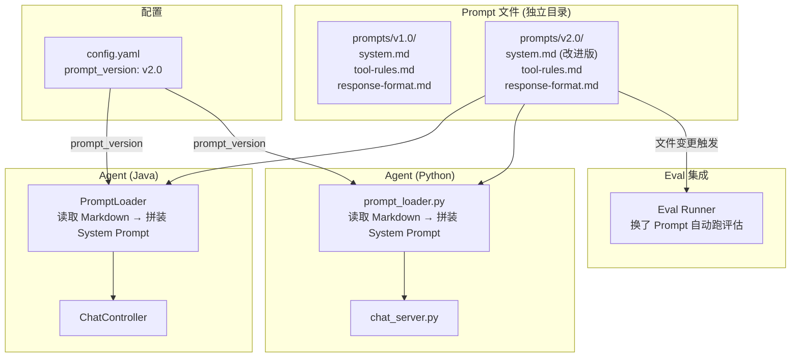
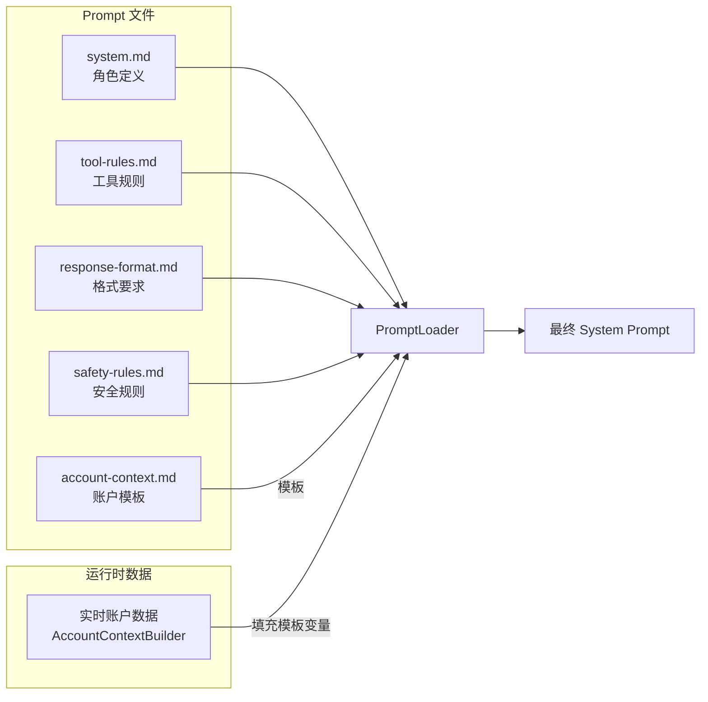
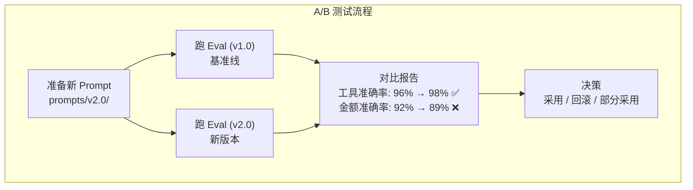
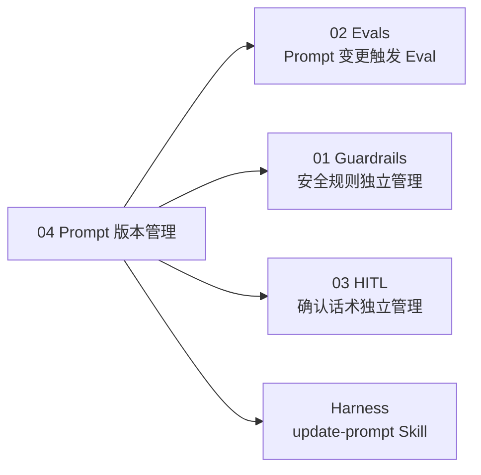

# 04 Prompt 版本管理 — 像管理代码一样管理 Prompt

> **优先级：★★★☆☆**
> **一句话理解：把 Prompt 从代码里抽出来，当成独立的"配置文件"管理——可以版本化、A/B 测试、回滚。**

---

## 用 Java 后端的经验来理解

你一定做过这样的事情：

| 场景 | 你不会怎么做 | 你会怎么做 |
|------|------------|-----------|
| 数据库连接串 | 硬编码在 Java 代码里 | 放 `application.yml`，按环境加载 |
| 短信模板 | 写死在 Service 里 | 放数据库/配置中心，运营可以改 |
| 业务规则阈值 | `if (amount > 10000)` | 放配置文件 `risk.threshold=10000` |

**Prompt 也是一样。** 它是你的 Agent 的"行为配置"——决定了 AI 怎么说话、怎么选工具、怎么拒绝无关请求。把它硬编码在 Java/Python 代码里，就像把数据库连接串硬编码在代码里一样——能跑，但不好维护。

---

## 当前项目的 Prompt 现状

### Java 侧

```java
// AccountContextBuilder.java 中
String systemPrompt = """
    你是一个专业的个人财务AI助手...
    ## 工具使用规则
    1. 查询余额 → query_balance
    2. 交易汇总 → summarize_transactions
    ...
    """;
```

### Python 侧

```python
# system_prompt.py 中
SYSTEM_PROMPT_TEMPLATE = """
你是一个专业的个人财务AI助手...
## 工具使用规则
...
"""
```

### 问题

1. **改 Prompt 要改代码**：调整一个措辞，需要改 Java 文件 → 重新编译 → 重启服务
2. **无法 A/B 测试**：想对比两个版本的 Prompt 哪个更好，要改代码切换
3. **无法回滚**：改了 Prompt 发现变差了，要 `git revert` 整个 commit
4. **无法追踪变化**：Prompt 嵌在业务代码中，`git log` 里很难看出"到底改了什么"
5. **Java/Python 双份维护**：两个语言各有一份 Prompt，容易不同步

---

## 架构设计

### 目标架构



### 文件结构设计

```
prompts/
├── v1.0/                           # 第一版（当前线上版本）
│   ├── system.md                   # 角色定义 + 行为约束
│   ├── tool-rules.md               # 工具选择决策规则
│   ├── response-format.md          # 回复格式要求
│   └── metadata.yaml               # 版本元数据
│
├── v2.0/                           # 改进版
│   ├── system.md                   # 优化了措辞
│   ├── tool-rules.md               # 新增子分类决策规则
│   ├── response-format.md
│   └── metadata.yaml
│
└── shared/                         # 跨版本共享（不常变）
    ├── safety-rules.md             # 安全规则（拒绝策略）
    └── account-context.md          # 账户上下文模板
```

### metadata.yaml 格式

```yaml
version: "2.0"
created: "2026-05-28"
author: "xuhu"
description: "优化工具选择规则，新增子分类支持"
changes:
  - "tool-rules.md: 新增 subCategory 参数的决策规则"
  - "response-format.md: 金额统一使用千分位格式"
eval_baseline:
  tool_accuracy: 0.96    # v1.0 的评估基准线
  amount_accuracy: 0.92  # v1.0 的评估基准线
```

---

## Prompt 模块化设计

### 为什么要拆分 Prompt？

当前的 System Prompt 是一个巨大的字符串，包含了角色、规则、格式、工具说明等所有内容。拆分的好处：

```
单体 Prompt（现在）：
┌────────────────────────────┐
│ 角色定义                    │
│ 工具选择规则                │ ← 改这里
│ 回复格式                    │
│ 安全规则                    │
│ 账户上下文                  │
└────────────────────────────┘
  改任何一部分都要碰整个文件

模块化 Prompt（目标）：
┌──────────┐ ┌──────────┐ ┌──────────┐
│ system.md │ │ tool-    │ │ response-│
│ 角色定义  │ │ rules.md │ │ format.md│
└──────────┘ │ 工具规则  │ └──────────┘
             └──────────┘
  ↑ 各改各的，互不影响
```

### Prompt 拼装流程



---

## 具体实现方案

### PromptLoader (Java)

```java
@Component
public class PromptLoader {

    @Value("${prompt.version:v1.0}")
    private String promptVersion;

    private final ResourceLoader resourceLoader;

    /**
     * 加载并拼装完整的 System Prompt。
     *
     * @param accountContext 实时账户上下文（由 AccountContextBuilder 生成）
     * @return 拼装后的完整 System Prompt
     */
    public String loadSystemPrompt(String accountContext) {
        String basePath = "prompts/" + promptVersion + "/";
        String sharedPath = "prompts/shared/";

        StringBuilder prompt = new StringBuilder();
        prompt.append(loadFile(basePath + "system.md"));
        prompt.append("\n\n");
        prompt.append(loadFile(basePath + "tool-rules.md"));
        prompt.append("\n\n");
        prompt.append(loadFile(basePath + "response-format.md"));
        prompt.append("\n\n");
        prompt.append(loadFile(sharedPath + "safety-rules.md"));
        prompt.append("\n\n");
        // 账户上下文模板 + 实时数据
        String contextTemplate = loadFile(sharedPath + "account-context.md");
        prompt.append(contextTemplate.replace("{{ACCOUNT_CONTEXT}}", accountContext));

        return prompt.toString();
    }

    private String loadFile(String path) {
        try {
            Resource resource = resourceLoader.getResource("classpath:" + path);
            return StreamUtils.copyToString(resource.getInputStream(), StandardCharsets.UTF_8);
        } catch (IOException e) {
            log.warn("Prompt 文件未找到: {}", path);
            return "";
        }
    }
}
```

### prompt_loader.py (Python)

```python
from pathlib import Path
import yaml

class PromptLoader:
    def __init__(self, version: str = None):
        self.base_dir = Path(__file__).parent.parent / "prompts"
        self.version = version or self._load_version_from_config()

    def load_system_prompt(self, account_context: str = "") -> str:
        version_dir = self.base_dir / self.version
        shared_dir = self.base_dir / "shared"

        parts = [
            self._read(version_dir / "system.md"),
            self._read(version_dir / "tool-rules.md"),
            self._read(version_dir / "response-format.md"),
            self._read(shared_dir / "safety-rules.md"),
            self._read(shared_dir / "account-context.md")
                .replace("{{ACCOUNT_CONTEXT}}", account_context),
        ]
        return "\n\n".join(filter(None, parts))

    def _read(self, path: Path) -> str:
        if path.exists():
            return path.read_text(encoding="utf-8")
        return ""

    def _load_version_from_config(self) -> str:
        config_path = self.base_dir.parent / "config.yaml"
        if config_path.exists():
            config = yaml.safe_load(config_path.read_text())
            return config.get("prompt", {}).get("version", "v1.0")
        return "v1.0"
```

### config.yaml 扩展

```yaml
ai:
  agent: python
  mcp: python

# 新增 prompt 配置
prompt:
  version: v1.0        # 当前使用的 Prompt 版本
  hot_reload: true      # 开发模式下文件变更自动重载
```

---

## A/B 测试方案

当你想对比两个版本的 Prompt 效果时：



```bash
# 跑 A/B 对比
PROMPT_VERSION=v1.0 python -m pytest evals/ -v --tb=short > eval-v1.0.txt
PROMPT_VERSION=v2.0 python -m pytest evals/ -v --tb=short > eval-v2.0.txt
diff eval-v1.0.txt eval-v2.0.txt
```

---

## 投入产出分析

### 投入

| 项目 | 估计工时 | 复杂度 |
|------|:-------:|:------:|
| Prompt 文件提取和拆分 | 2h | 低 |
| PromptLoader (Java) | 3h | 低 |
| PromptLoader (Python) | 2h | 低 |
| config.yaml 扩展 | 1h | 低 |
| metadata.yaml 规范 | 1h | 低 |
| A/B 测试脚本 | 2h | 低 |
| 修改 Prompt 的 Skill | 2h | 中 |
| **总计** | **~13h** | — |

### 产出

| 维度 | 效果 |
|------|------|
| **学习价值** | 掌握 Prompt 工程化管理——这是 AI 应用开发的日常 |
| **开发效率** | 改 Prompt 不用改代码、不用重新编译，秒级生效 |
| **质量保障** | 配合 Eval，每次 Prompt 变更都有量化对比 |
| **双栈一致性** | Java/Python 共享同一份 Prompt 文件，不再双份维护 |
| **Harness 延伸** | 自然衍生出 `update-prompt` Skill |

### 不做的影响

| 问题 | 严重程度 |
|------|:-------:|
| 改 Prompt 要改 Java 代码 + 重编译 | 🟡 不方便但能忍 |
| Java/Python 两份 Prompt 不同步 | 🟡 容易出错 |
| 无法快速回滚到上一版 Prompt | 🟡 git revert 可以但粗糙 |

---

## 与其他方向的协同



---

## 落地建议

**第一步（2h）**：将现有 System Prompt 提取到 `prompts/v1.0/` 目录，拆成 3 个文件
**第二步（3h）**：实现 Java PromptLoader，替换 AccountContextBuilder 中的硬编码
**第三步（2h）**：实现 Python prompt_loader.py，替换 system_prompt.py 中的硬编码
**第四步（2h）**：扩展 config.yaml，支持 prompt.version 配置
**第五步（2h）**：编写 `update-prompt` Skill，标准化 Prompt 变更流程

完成后的效果：改 Prompt 只需要编辑 Markdown 文件，`config.yaml` 切换版本，配合 Eval 自动验证效果。
