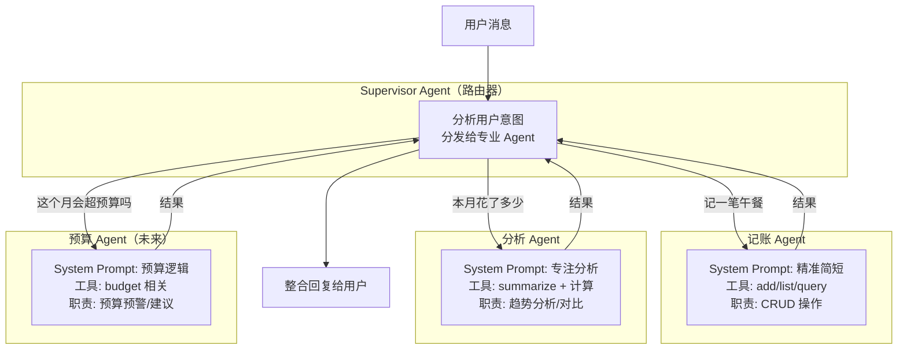
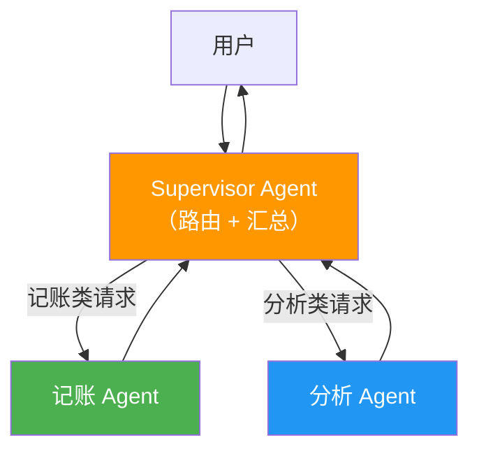
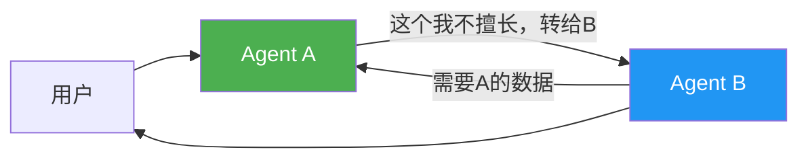
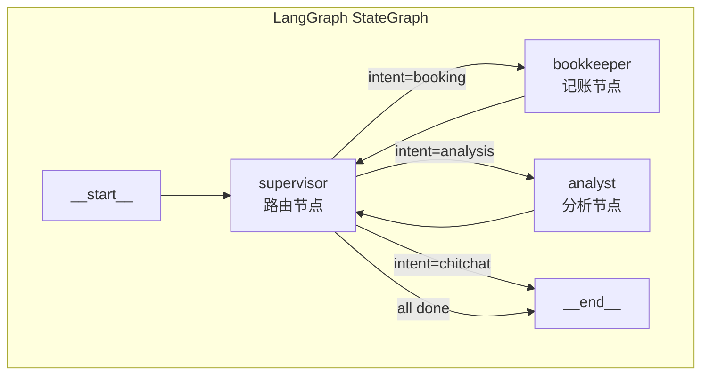
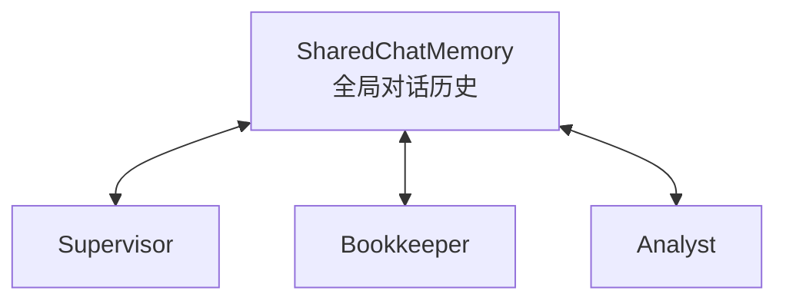

# 05 Multi-Agent 协作 — 多个 AI 分工协作

> **优先级：★★★☆☆**
> **一句话理解：Multi-Agent 就是 AI 版的"微服务架构"——把一个大 Agent 拆成多个专业 Agent，各司其职。**

---

## 用 Java 后端的经验来理解

你一定经历过这个演进过程：

```
单体应用（一个 Spring Boot 搞定所有）
    ↓ 业务变复杂
微服务（订单服务 + 支付服务 + 用户服务 + 通知服务）
    ↓ 需要协调
API Gateway / 服务编排（Orchestrator 统一调度）
```

Multi-Agent 是完全相同的思路：

```
单 Agent（一个 Agent 搞定所有对话）    ← 你现在在这里
    ↓ 能力变复杂
Multi-Agent（记账 Agent + 分析 Agent + 预算 Agent）
    ↓ 需要协调
Supervisor Agent（路由 Agent 统一分发）
```

| 微服务中 | Multi-Agent 中 |
|---------|---------------|
| 每个服务有自己的数据库 | 每个 Agent 有自己的 System Prompt 和工具集 |
| API Gateway 路由请求 | Supervisor Agent 路由用户消息 |
| 服务间通过 HTTP/RPC 通信 | Agent 间通过消息传递通信 |
| 每个服务独立部署扩展 | 每个 Agent 可以用不同的 LLM 模型 |

---

## 为什么考虑 Multi-Agent？

### 单 Agent 的瓶颈

你当前的 Agent 是一个"全能选手"，System Prompt 里塞了所有规则：

```
当前 System Prompt:
├── 角色定义（你是记账助手）
├── 工具选择规则（5 个工具的决策逻辑）
├── 回复格式（金额格式、表格格式）
├── 安全规则（拒绝策略）
└── 账户上下文（实时注入）
```

当你继续添加功能（预算管理、趋势分析、财务建议），System Prompt 会越来越长：

```
未来的 System Prompt 可能变成:
├── 角色定义
├── 工具选择规则（10+ 个工具）
├── 回复格式
├── 安全规则
├── 账户上下文
├── 预算规则（新增）
├── 分析规则（新增）
├── 建议规则（新增）
└── ...越来越长，LLM 越来越容易"忘记"前面的规则
```

**核心问题**：LLM 的注意力是有限的。System Prompt 越长，末尾规则被遵守的概率越低。这是 LLM 的**"Lost in the Middle"**问题。

### Multi-Agent 的解法



每个 Agent 的 System Prompt 都很短（~500 token），只包含自己领域的规则。LLM 的"注意力集中"了，准确率自然提高。

---

## 两种 Multi-Agent 模式

### 模式 1：Supervisor 模式（推荐起步）



**特点**：
- Supervisor 是"中心节点"，所有消息都经过它
- Supervisor 自己也是一个 LLM，它的 System Prompt 只负责"分类用户意图"
- 子 Agent 不直接和用户交互，只接收 Supervisor 的指令
- **类似微服务中的 API Gateway + Orchestrator**

### 模式 2：Swarm 模式（高级，暂不推荐）



**特点**：
- 没有中心节点，Agent 之间直接通信
- Agent 可以自主决定"把任务转给谁"
- 更灵活但更复杂，调试困难
- **类似微服务中的 Event-Driven 架构**

**建议你从 Supervisor 模式开始。** 它结构清晰、易于调试、符合你的 Java 后端思维方式。

---

## 架构设计

### 在 LangGraph 中的实现

LangGraph 原生支持 Multi-Agent，这是 Python 侧的天然优势：



```python
from langgraph.graph import StateGraph, MessagesState, Command
from langchain_core.messages import HumanMessage

def supervisor_node(state: MessagesState) -> Command:
    """路由节点：分析意图，决定转发给哪个子 Agent"""
    response = supervisor_llm.invoke([
        SystemMessage(content="""
            你是一个路由器。分析用户的请求，返回应该处理的 Agent 名称：
            - bookkeeper: 记账、查余额、查交易记录
            - analyst: 趋势分析、对比、汇总统计
            只返回 Agent 名称，不要回答用户问题。
        """),
        *state["messages"]
    ])

    target = response.content.strip().lower()
    if target in ("bookkeeper", "analyst"):
        return Command(goto=target)
    return Command(goto="__end__", update={"messages": [response]})


def bookkeeper_node(state: MessagesState) -> Command:
    """记账 Agent：处理 CRUD 操作"""
    response = bookkeeper_agent.invoke(state["messages"])
    return Command(goto="supervisor", update={"messages": [response]})


def analyst_node(state: MessagesState) -> Command:
    """分析 Agent：处理统计和趋势分析"""
    response = analyst_agent.invoke(state["messages"])
    return Command(goto="supervisor", update={"messages": [response]})


# 构建图
graph = StateGraph(MessagesState)
graph.add_node("supervisor", supervisor_node)
graph.add_node("bookkeeper", bookkeeper_node)
graph.add_node("analyst", analyst_node)
graph.add_edge("__start__", "supervisor")
app = graph.compile()
```

### 在 Spring AI 中的实现

Spring AI 目前没有原生 Multi-Agent 支持，需要手动编排。这本身就是很好的学习点——**你会理解 LangGraph 在底层做了什么**。

```java
@Service
public class SupervisorAgent {

    private final ChatClient supervisorClient;  // 只做路由
    private final BookkeeperAgent bookkeeperAgent;
    private final AnalystAgent analystAgent;

    /**
     * 路由用户请求到对应的专业 Agent
     */
    public Flux<String> handle(String userMessage, String userId) {
        // 1. Supervisor 分析意图
        String intent = classifyIntent(userMessage);

        // 2. 路由到对应 Agent
        return switch (intent) {
            case "booking" -> bookkeeperAgent.handle(userMessage, userId);
            case "analysis" -> analystAgent.handle(userMessage, userId);
            default -> Flux.just("我是记账助手，请问有什么记账或财务分析的问题吗？");
        };
    }

    private String classifyIntent(String userMessage) {
        String response = supervisorClient.prompt()
            .system("""
                你是一个意图分类器。分析用户消息，返回以下分类之一：
                - booking: 记一笔、查余额、查交易
                - analysis: 分析趋势、对比、汇总
                - other: 与记账无关
                只返回分类名称。
            """)
            .user(userMessage)
            .call()
            .content();
        return response.trim().toLowerCase();
    }
}
```

```java
@Component
public class BookkeeperAgent {
    private final ChatClient chatClient;

    public Flux<String> handle(String userMessage, String userId) {
        return chatClient.prompt()
            .system("""
                你是记账专员。你只负责：
                1. 记录新交易 (add_transaction)
                2. 查询余额 (query_balance)
                3. 列出交易明细 (list_transactions)
                4. 列出账户 (list_accounts)
                你不做任何分析或建议。
            """)
            .user(userMessage)
            .stream()
            .content();
    }
}
```

---

## 子 Agent 划分方案

### 第一阶段：2 个 Agent

| Agent | 职责 | 工具 | System Prompt 核心规则 |
|-------|------|------|----------------------|
| **Bookkeeper（记账员）** | 记录交易、查询余额和交易明细 | `add_transaction`, `query_balance`, `list_transactions`, `list_accounts` | 精确执行 CRUD，不做分析 |
| **Analyst（分析师）** | 趋势分析、对比、汇总统计 | `summarize_transactions`, `list_transactions` | 提供数据洞察和可视化建议 |

### 第二阶段：3 个 Agent（+预算顾问）

| Agent | 新增职责 | 新增工具 |
|-------|---------|---------|
| **Advisor（预算顾问）** | 预算预警、消费建议、储蓄目标 | `check_budget`, `set_budget` |

### 意图路由示例

```
"记一笔午餐30元"              → Bookkeeper ✅
"我的余额是多少"              → Bookkeeper ✅
"本月餐饮花了多少"            → Analyst ✅
"和上个月对比花销"            → Analyst ✅
"按照目前的花销速度，月底还剩多少" → Analyst ✅（计算推理）
"这个月会超预算吗"            → Advisor ✅（第二阶段）
"帮我写一首诗"               → Supervisor 直接拒绝 ✅
```

---

## 挑战与解决方案

### 挑战 1：上下文传递

用户先说"记一笔午餐"（→ Bookkeeper），然后说"今天一共花了多少"（→ Analyst）。Analyst 需要知道之前的对话上下文。

**解决方案：共享消息历史**



所有 Agent 共享同一个 ChatMemory，每个 Agent 在处理时都能看到完整的对话历史。

### 挑战 2：路由准确率

Supervisor 的意图分类本身也依赖 LLM，可能分错。

**解决方案：**
1. **关键词辅助**：在 LLM 分类之前，先用关键词匹配做初筛
2. **兜底策略**：分类不确定时，默认交给 Bookkeeper（最通用）
3. **Eval 覆盖**：Golden Dataset 中增加"意图路由"维度的测试用例

### 挑战 3：循环调用

Bookkeeper 处理完后返回给 Supervisor，Supervisor 可能又把结果发给 Analyst，形成循环。

**解决方案：最大轮次限制**

```python
# LangGraph 中设置 recursion_limit
app = graph.compile()
result = app.invoke(
    {"messages": [HumanMessage(content=user_input)]},
    config={"recursion_limit": 5}  # 最多 5 轮
)
```

---

## Java vs Python 对比

| 维度 | Python (LangGraph) | Java (Spring AI) |
|------|:------------------:|:----------------:|
| 原生 Multi-Agent 支持 | ✅ `StateGraph` + `Command` | ❌ 需手动编排 |
| 实现复杂度 | 低（框架内置） | 中（自己写路由） |
| 可视化调试 | ✅ LangSmith 内置图可视化 | ❌ 需要自己做 |
| 学习价值 | 学习 LangGraph 设计理念 | 理解 Multi-Agent 底层原理 |
| 灵活性 | 框架约束较多 | 完全自由 |

**建议两边都实现**：Python 侧用 LangGraph 的原生方案，Java 侧手动编排。对比后你会深刻理解 LangGraph 的 `StateGraph` 到底解决了什么问题。

---

## 投入产出分析

### 投入

| 项目 | 估计工时 | 复杂度 |
|------|:-------:|:------:|
| Python Supervisor + 2 个子 Agent (LangGraph) | 8h | 中 |
| Java Supervisor + 2 个子 Agent (手动编排) | 10h | 中高 |
| 共享 ChatMemory 改造 | 4h | 中 |
| 前端适配（显示当前处理的 Agent） | 3h | 低 |
| 意图路由 Eval 用例 | 3h | 低 |
| 测试 | 4h | 中 |
| **总计** | **~32h** | — |

### 产出

| 维度 | 效果 |
|------|------|
| **学习价值** | 掌握 2025-2026 AI 应用架构的主流趋势 |
| **技术深度** | LangGraph StateGraph + Spring AI 手动编排的对比极有价值 |
| **可扩展性** | 未来加新能力只需新增一个子 Agent，不影响已有 Agent |
| **项目差异化** | Multi-Agent 在 Demo 项目中非常少见 |

### 前置依赖

```
01 Guardrails  →  每个子 Agent 都需要独立的 Guardrails
02 Evals       →  需要评估意图路由准确率
04 Prompt 管理 →  每个 Agent 的 Prompt 需要独立版本管理
```

**建议在完成前 4 个方向后再做 Multi-Agent**，这样每个子 Agent 都自带 Guardrails + Eval + Prompt 管理。

---

## 落地建议

**第一步（4h）**：Python 侧用 LangGraph 实现 Supervisor + Bookkeeper + Analyst
**第二步（5h）**：Java 侧手动实现相同的 Supervisor 路由架构
**第三步（4h）**：共享 ChatMemory 改造，确保上下文跨 Agent 传递
**第四步（3h）**：前端适配，ChatPanel 显示当前处理的 Agent 名称
**第五步（3h）**：编写意图路由 Eval 用例，验证路由准确率

完成后的效果：用户的每条消息会被自动路由到最专业的 Agent 处理。前端可以看到"📝 记账员正在处理..."或"📊 分析师正在处理..."的提示。
