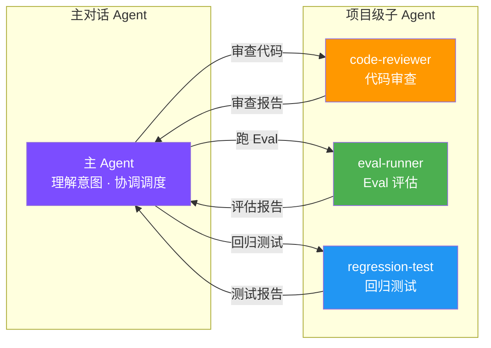
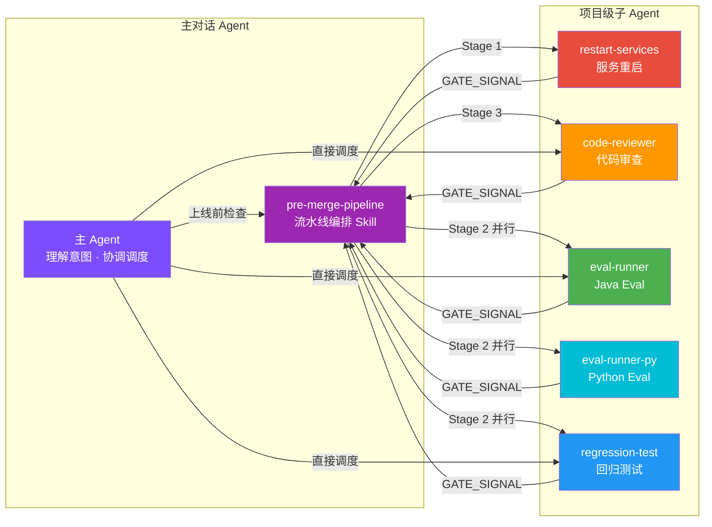

# Sub-Agent 架构升级实施计划

> **For agentic workers:** REQUIRED SUB-SKILL: Use superpowers:subagent-driven-development (recommended) or superpowers:executing-plans to implement this plan task-by-task. Steps use checkbox (`- [ ]`) syntax for tracking.

**Goal:** 为项目 4 个子 Agent 追加机器可读的 GATE_SIGNAL 输出，新增 pipeline 编排 Skill 实现自动化上线前检查流水线，拆分 eval-runner 实现双栈并行。

**Architecture:** 子 Agent 输出标准化（HTML 注释中嵌入 JSON gate 信号）→ 主对话 Skill 编排子 Agent（串行 + 并行调度 + gate 流转）→ eval-runner 拆分为 Java/Python 两个独立 Agent，由 pipeline 编排层实现并行。

**Tech Stack:** Claude Code Sub-Agents (YAML frontmatter + Markdown)、Claude Code Skills (Markdown)

**Spec:** `docs/superpowers/specs/2026-06-08-subagent-pipeline-design.md`

---

## 说明

本计划全部改动是 Markdown 定义文件（Agent / Skill / 文档），不涉及运行时代码（Java/Python/Vue）。因此 TDD 适配为：
- **"测试"**：定义 GATE_SIGNAL JSON 的预期 schema，或验证 Markdown 结构正确性
- **"实现"**：编写/修改 Agent 和 Skill 的 Markdown 内容
- **"验证"**：检查 GATE_SIGNAL 格式是否合法、Markdown 渲染是否正确

---

## Phase 1：子 Agent 输出标准化（GATE_SIGNAL）

### Task 1: 为 restart-services 追加 GATE_SIGNAL

**Files:**
- Modify: `.claude/agents/restart-services.md` — 在「输出报告」section 末尾追加 GATE_SIGNAL 生成指令

- [ ] **Step 1: 定义 restart-services 的 GATE_SIGNAL 预期格式**

此 Agent 的 GATE_SIGNAL 应包含：
```json
{
  "agent": "restart-services",
  "status": "pass",
  "metrics": {
    "servicesUp": 4,
    "servicesTotal": 4
  },
  "blockers": [],
  "timestamp": "2026-06-08T14:30:00Z"
}
```
- `status=pass`：当 JSON 结果中 `status == "success"` 且所有 services 的 status 都是 UP
- `status=fail`：当任何服务启动失败
- `blockers`：列出失败的服务名称和原因

- [ ] **Step 2: 在 restart-services.md 的 Step 3 报告末尾追加 GATE_SIGNAL 指令**

在 `.claude/agents/restart-services.md` 的 `### Step 3: 输出报告` section 末尾（第 67 行 ` ``` ` 之后、`### Step 4` 之前），追加以下内容：

```markdown

### GATE_SIGNAL

在 Markdown 报告的**最末尾**，追加一个 HTML 注释块，供上层 pipeline 编排使用。格式严格遵循以下模板：

```
<!-- GATE_SIGNAL
{
  "agent": "restart-services",
  "status": "{pass 或 fail}",
  "metrics": {
    "servicesUp": {成功启动的服务数},
    "servicesTotal": {总服务数}
  },
  "blockers": [{失败时列出具体服务名和原因，如 "Agent :8081 启动失败: JAVA_HOME 未设置"}],
  "timestamp": "{ISO 8601 格式当前时间}"
}
-->
```

- 全部服务 UP → `status: "pass"`，`blockers: []`
- 任一服务失败 → `status: "fail"`，`blockers` 列出每个失败服务的名称和原因
```

- [ ] **Step 3: 验证 Markdown 结构**

检查修改后的文件：
- GATE_SIGNAL section 位于 Step 3 和 Step 4 之间
- HTML 注释中的 JSON 模板语法正确
- 未破坏原有报告格式

无需运行命令，通过 Read 工具检查文件即可。

---

### Task 2: 为 eval-runner 追加 GATE_SIGNAL

**Files:**
- Modify: `.claude/agents/eval-runner.md` — 在「输出报告」section 末尾追加 GATE_SIGNAL 生成指令

- [ ] **Step 1: 定义 eval-runner 的 GATE_SIGNAL 预期格式**

```json
{
  "agent": "eval-runner",
  "status": "pass",
  "metrics": {
    "passRate": 1.0,
    "passed": 12,
    "total": 12
  },
  "blockers": [],
  "timestamp": "2026-06-08T14:30:00Z"
}
```
- `status=pass`：passRate == 1.0（100% 通过）
- `status=fail`：passRate < 1.0
- `blockers`：列出每个失败 case 的 ID、维度和失败原因

- [ ] **Step 2: 在 eval-runner.md 的「输出报告」section 末尾追加 GATE_SIGNAL 指令**

在 `.claude/agents/eval-runner.md` 的 `## 输出报告` section 末尾（第 89 行 ` ``` ` 之后、`## 可选` 之前），追加以下内容：

```markdown

### GATE_SIGNAL

在 Markdown 报告的**最末尾**，追加一个 HTML 注释块，供上层 pipeline 编排使用：

```
<!-- GATE_SIGNAL
{
  "agent": "eval-runner",
  "status": "{pass 或 fail}",
  "metrics": {
    "passRate": {passed/total 的浮点数，如 1.0},
    "passed": {通过数},
    "total": {总数}
  },
  "blockers": [{失败时列出每个失败 case，如 "tool_selection#3: 未调用 query_balance"}],
  "timestamp": "{ISO 8601 格式当前时间}"
}
-->
```

- 全部通过（passRate == 1.0）→ `status: "pass"`，`blockers: []`
- 存在失败 → `status: "fail"`，`blockers` 列出每个失败 case 的 `id: failReason`
```

- [ ] **Step 3: 验证 Markdown 结构**

通过 Read 工具检查文件，确认 GATE_SIGNAL section 位置正确，JSON 模板语法合法。

---

### Task 3: 为 regression-test 追加 GATE_SIGNAL

**Files:**
- Modify: `.claude/agents/regression-test.md` — 在「输出报告」section 末尾追加 GATE_SIGNAL 生成指令

- [ ] **Step 1: 定义 regression-test 的 GATE_SIGNAL 预期格式**

```json
{
  "agent": "regression-test",
  "status": "pass",
  "metrics": {
    "passRate": 1.0,
    "passed": 5,
    "total": 5,
    "avgLatencyS": 3.2
  },
  "blockers": [],
  "timestamp": "2026-06-08T14:30:00Z"
}
```
- `status=pass`：全部场景 passed
- `status=fail`：任一场景 fail
- `blockers`：列出失败场景名称和 error 内容

- [ ] **Step 2: 在 regression-test.md 的「输出报告」section 末尾追加 GATE_SIGNAL 指令**

在 `.claude/agents/regression-test.md` 的 `### 4. 输出报告` section 末尾（第 69 行 ` ``` ` 之后、`如果 `audit_issues`` 之前），追加以下内容：

```markdown

### GATE_SIGNAL

在 Markdown 报告的**最末尾**，追加一个 HTML 注释块，供上层 pipeline 编排使用：

```
<!-- GATE_SIGNAL
{
  "agent": "regression-test",
  "status": "{pass 或 fail}",
  "metrics": {
    "passRate": {passed/total 的浮点数},
    "passed": {通过场景数},
    "total": {总场景数},
    "avgLatencyS": {平均响应时间秒}
  },
  "blockers": [{失败时列出失败场景，如 "单Agent-查余额: timeout"}],
  "timestamp": "{ISO 8601 格式当前时间}"
}
-->
```

- 全部场景通过 → `status: "pass"`，`blockers: []`
- 存在失败场景 → `status: "fail"`，`blockers` 列出每个失败场景的名称和 error
```

- [ ] **Step 3: 验证 Markdown 结构**

通过 Read 工具检查文件，确认 GATE_SIGNAL section 位置正确。

---

### Task 4: 为 code-reviewer 追加 GATE_SIGNAL

**Files:**
- Modify: `.claude/agents/code-reviewer.md` — 在「输出审查报告」section 末尾追加 GATE_SIGNAL 生成指令

- [ ] **Step 1: 定义 code-reviewer 的 GATE_SIGNAL 预期格式**

```json
{
  "agent": "code-reviewer",
  "status": "pass",
  "metrics": {
    "critical": 0,
    "warning": 2,
    "info": 1
  },
  "blockers": [],
  "timestamp": "2026-06-08T14:30:00Z"
}
```
- `status=pass`：无 🔴 严重问题（critical == 0）
- `status=fail`：存在 🔴 严重问题（critical > 0）
- `blockers`：列出每个 🔴 严重问题的描述

- [ ] **Step 2: 在 code-reviewer.md 的「审查优先级」section 末尾追加 GATE_SIGNAL 指令**

在 `.claude/agents/code-reviewer.md` 的最末尾（第 125 行 `ℹ️ **参考**` 之后），追加以下内容：

```markdown

### GATE_SIGNAL

在审查报告的**最末尾**，追加一个 HTML 注释块，供上层 pipeline 编排使用：

```
<!-- GATE_SIGNAL
{
  "agent": "code-reviewer",
  "status": "{pass 或 fail}",
  "metrics": {
    "critical": {🔴 严重问题数},
    "warning": {🟡 建议数},
    "info": {ℹ️ 参考数}
  },
  "blockers": [{fail 时列出每个严重问题，如 "Model 字段变更未同步 MCP Server"}],
  "timestamp": "{ISO 8601 格式当前时间}"
}
-->
```

- 无 🔴 严重问题（critical == 0）→ `status: "pass"`，`blockers: []`
- 存在 🔴 严重问题 → `status: "fail"`，`blockers` 列出每个严重问题描述
```

- [ ] **Step 3: 验证 Markdown 结构**

通过 Read 工具检查文件，确认 GATE_SIGNAL section 是文件最后一个 section。

---

### Task 5: 提交 Phase 1

- [ ] **Step 1: 检查变更范围**

Run: `git diff --name-only`
Expected: 仅 4 个文件
```
.claude/agents/code-reviewer.md
.claude/agents/eval-runner.md
.claude/agents/regression-test.md
.claude/agents/restart-services.md
```

- [ ] **Step 2: 提交**

```bash
git add .claude/agents/code-reviewer.md .claude/agents/eval-runner.md .claude/agents/regression-test.md .claude/agents/restart-services.md
git commit -m "feat: 4 个子 Agent 输出追加 GATE_SIGNAL 标准化信号块

为 code-reviewer、eval-runner、regression-test、restart-services 追加
机器可读的 GATE_SIGNAL HTML 注释块，供上层 pipeline 编排解析使用。
向后兼容——HTML 注释在 Markdown 渲染时不可见。

Co-Authored-By: Claude Opus 4.6 <noreply@anthropic.com>"
```

---

## Phase 2：Pre-Merge Pipeline Skill

### Task 6: 创建 pre-merge-pipeline Skill

**Files:**
- Create: `.claude/skills/pre-merge-pipeline/SKILL.md`

- [ ] **Step 1: 创建目录**

Run: `mkdir -p .claude/skills/pre-merge-pipeline`

- [ ] **Step 2: 编写 SKILL.md**

创建 `.claude/skills/pre-merge-pipeline/SKILL.md`，内容如下：

````markdown
# Pre-Merge Pipeline

上线前全套检查流水线。自动编排子 Agent 按依赖顺序执行，并行化无依赖阶段，gate 判断控制流转。

## 触发词

用户说"上线前检查"、"pre-merge"、"跑流水线"、"pipeline"时使用此 Skill。

## 可选参数

| 参数 | 说明 | 默认值 |
|------|------|--------|
| `--skip-restart` | 服务已在运行时跳过 Stage 1 | 不跳过 |
| `--skip-review` | 跳过 Stage 3 代码审查 | 不跳过 |
| `--dual` | eval 阶段同时跑 Java + Python 双栈 | 仅 Java |

## 流水线拓扑

```
Stage 1: restart-services              (串行，前置条件)
    ↓ gate: status == "pass"
Stage 2: eval-runner ∥ regression-test  (并行，互相独立)
    ↓ gate: 全部 status == "pass"
Stage 3: code-reviewer                 (串行，最终审查)
    ↓ gate: 无严重问题 → pass（警告不阻断）
    ↓
  输出最终报告
```

## 执行流程

### 0. 前置检查

```bash
# 检查 .env 是否存在
test -f .env && echo ".env OK" || echo ".env MISSING"

# 检查未提交变更
git status --porcelain
```

- `.env` 不存在 → 输出 "❌ 缺少 .env 配置文件，请先 `cp .env.example .env` 并填入 API Key"，终止流水线
- 有未提交变更 → 输出 "⚠️ 当前有未提交变更，建议先 commit 再跑流水线"，继续执行（不终止）

记录流水线开始时间和当前分支名。

### 1. Stage 1: 服务重启

**如果带 `--skip-restart` 参数，跳过此阶段。**

使用 Agent 工具 dispatch `restart-services` 子 Agent：

```
Agent({
  subagent_type: "restart-services",
  prompt: "重启全部服务并验证健康状态。执行完毕后输出报告。"
})
```

等待子 Agent 完成。从返回文本中解析 GATE_SIGNAL：

```
正则匹配: /<!-- GATE_SIGNAL\n([\s\S]*?)\n-->/
```

**Gate 判断：**
- 匹配失败 → `status: "fail"`，blockers: `["GATE_SIGNAL 未找到，请确认 restart-services Agent 已更新"]`
- `status == "pass"` → 继续到 Stage 2
- `status == "fail"` → 输出失败报告（含 blockers），终止流水线

### 2. Stage 2: Eval + 回归测试（并行）

使用 Agent 工具**同时**（在同一条消息中发出多个 Agent 调用） dispatch 子 Agent：

**默认模式（无 --dual）：**
```
Agent({
  subagent_type: "eval-runner",
  prompt: "运行 Java 栈 Agent Eval 测试，输出完整报告。"
})
Agent({
  subagent_type: "regression-test",
  prompt: "运行回归测试（3 轮），输出完整报告。"
})
```

**双栈模式（带 --dual）：**
```
Agent({
  subagent_type: "eval-runner",
  prompt: "运行 Java 栈 Agent Eval 测试，输出完整报告。"
})
Agent({
  subagent_type: "eval-runner-py",
  prompt: "运行 Python 栈 Agent Eval 测试，输出完整报告。"
})
Agent({
  subagent_type: "regression-test",
  prompt: "运行回归测试（3 轮），输出完整报告。"
})
```

等待全部子 Agent 完成。分别解析每个 Agent 返回文本中的 GATE_SIGNAL。

**Gate 判断：**
- 任一 Agent 的 GATE_SIGNAL 匹配失败 → 视为该 Agent fail
- **全部** `status == "pass"` → 继续到 Stage 3
- **任一** `status == "fail"` → 输出失败报告（含所有 Agent 的结果和 blockers），终止流水线

### 3. Stage 3: 代码审查

**如果带 `--skip-review` 参数，跳过此阶段。**

```
Agent({
  subagent_type: "code-reviewer",
  prompt: "审查当前分支相对于 master 的所有变更，输出审查报告。"
})
```

等待完成，解析 GATE_SIGNAL。

**Gate 判断（不同于其他 Stage）：**
- `status == "fail"`（有严重问题）→ 标记 ⚠️ 警告，**但不终止流水线**
- `status == "pass"` → 正常继续

### 4. 输出最终报告

汇总所有 Stage 的结果，按以下模板输出：

```markdown
## Pre-Merge Pipeline 报告

**分支**: {branch_name}
**时间**: {start_time} ~ {end_time}
**总耗时**: {duration}
**结论**: ✅ 可以合并 / ❌ 流水线失败于 Stage {n}

### 阶段概览

| Stage | Agent | 状态 | 关键指标 |
|-------|-------|------|---------|
| 1. 服务重启 | restart-services | ✅/❌/⏭️ | {servicesUp}/{servicesTotal} 服务 UP |
| 2a. Eval (Java) | eval-runner | ✅/❌ | {passed}/{total} ({passRate}%) |
| 2b. Eval (Python) | eval-runner-py | ✅/❌/⏭️ | {passed}/{total} ({passRate}%) |
| 2c. 回归测试 | regression-test | ✅/❌ | {passed}/{total}, 平均 {avgLatencyS}s |
| 3. 代码审查 | code-reviewer | ✅/⚠️/⏭️ | {critical} 严重 / {warning} 建议 |

（⏭️ = 已跳过）

### 失败详情（如有）

{汇总所有 status=="fail" 的 Agent 的 blockers，按 Stage 分组列出}

### 代码审查建议（如有）

{从 code-reviewer 的 blockers 或 metrics 中摘录建议项}
```

## GATE_SIGNAL 解析规范

所有子 Agent 在 Markdown 报告末尾输出的 GATE_SIGNAL 格式：

```
<!-- GATE_SIGNAL
{
  "agent": "{agent-name}",
  "status": "pass" | "fail",
  "metrics": { ... },
  "blockers": ["...", "..."],
  "timestamp": "ISO 8601"
}
-->
```

解析步骤：
1. 对 Agent 返回的完整文本做正则匹配：`/<!-- GATE_SIGNAL\n([\s\S]*?)\n-->/`
2. 提取第一个捕获组的 JSON 字符串
3. 解析 JSON，读取 `status`、`metrics`、`blockers`
4. 匹配失败 → 视为 `status: "fail"`，blockers: `["GATE_SIGNAL 未找到"]`
````

- [ ] **Step 3: 验证 SKILL.md 结构**

通过 Read 工具检查文件：
- 包含触发词、可选参数、流水线拓扑、执行流程、GATE_SIGNAL 解析规范
- Agent dispatch 示例使用正确的 subagent_type 名称
- 报告模板包含所有 Stage 和指标

---

### Task 7: 提交 Phase 2

- [ ] **Step 1: 检查变更范围**

Run: `git status`
Expected: 新增 1 个文件
```
.claude/skills/pre-merge-pipeline/SKILL.md
```

- [ ] **Step 2: 提交**

```bash
git add .claude/skills/pre-merge-pipeline/SKILL.md
git commit -m "feat: 新增 pre-merge-pipeline 编排 Skill

主对话级 Skill，自动编排 4 个子 Agent 按依赖顺序执行：
restart → eval ∥ regression（并行）→ code-review。
支持 --skip-restart、--skip-review、--dual 参数。
通过 GATE_SIGNAL 做阶段间 gate 判断。

Co-Authored-By: Claude Opus 4.6 <noreply@anthropic.com>"
```

---

## Phase 3：双栈并行探索

### Task 8: 创建 eval-runner-py Agent

**Files:**
- Create: `.claude/agents/eval-runner-py.md`

- [ ] **Step 1: 编写 eval-runner-py.md**

创建 `.claude/agents/eval-runner-py.md`，内容如下：

````markdown
---
name: eval-runner-py
description: Python 栈 Eval 执行器。运行 Python Golden Dataset 评估测试，汇总通过率和失败 case。用户提到"跑 Python eval"、"Python 评估"时自动触发。
tools: Bash, Read, Grep
model: inherit
permissionMode: default
maxTurns: 15
color: cyan
---

你是本项目的 Python 栈 Eval 测试执行器。职责是运行 Python Agent 行为评估，收集结果，输出结构化报告。遵循 CLAUDE.md 项目规范。

你运行在项目根目录下，所有路径相对项目根目录。

## 前置条件

Eval 依赖 Backend + Python MCP Server 提供真实工具调用：

```bash
lsof -ti:8080 >/dev/null 2>&1 && echo "Backend OK" || echo "Backend DOWN"
lsof -ti:8083 >/dev/null 2>&1 && echo "MCP Python OK" || echo "MCP Python DOWN"
```

如果任一服务 DOWN，报告并终止。

## 执行 Eval

```bash
cd finance-agent-py && source .venv/bin/activate && pytest ../evals/py/ -v 2>&1
```

如果虚拟环境不存在，报告 "请先在 finance-agent-py/ 下创建虚拟环境：python3 -m venv .venv && pip install -r requirements.txt"。

耐心等待（最长 3 分钟），不要中断。

## 读取报告

```bash
ls -t evals/reports/eval-python-*.json 2>/dev/null | head -1
```

用 Read 工具读取最新 JSON 报告，提取：
- `summary.total` / `summary.passed` / `summary.failed`
- `summary.passRate`（如无此字段，自行计算 passed/total*100）
- `summary.categories` 各维度的通过率
- 失败 case 的 `id`、`category`、`input`、`failReason`

如果无 JSON 报告文件，从 pytest 输出中解析通过/失败数量。

## 输出报告

```markdown
## Python Eval 测试报告

**时间**: {timestamp}
**栈**: Python
**通过率**: {passed}/{total} ({passRate}%)

### 按维度

| 维度 | 通过/总数 | 通过率 |
|------|-----------|--------|
| tool_selection | {p}/{t} | {rate}% |
| rejection | {p}/{t} | {rate}% |
| amount_accuracy | {p}/{t} | {rate}% |
| multi_turn | {p}/{t} | {rate}% |
| tool_conflict | {p}/{t} | {rate}% |
| correction | {p}/{t} | {rate}% |
| intent_routing | {p}/{t} | {rate}% |

### 失败 Case（如有）

| ID | 维度 | 输入 | 失败原因 |
|----|------|------|----------|
| ... | ... | ... | ... |

**结论**: ✓ 全部通过 / ✗ {n} 条失败
```

### GATE_SIGNAL

在 Markdown 报告的**最末尾**，追加一个 HTML 注释块，供上层 pipeline 编排使用：

```
<!-- GATE_SIGNAL
{
  "agent": "eval-runner-py",
  "status": "{pass 或 fail}",
  "metrics": {
    "passRate": {passed/total 的浮点数，如 1.0},
    "passed": {通过数},
    "total": {总数}
  },
  "blockers": [{失败时列出每个失败 case，如 "tool_selection#3: 未调用 query_balance"}],
  "timestamp": "{ISO 8601 格式当前时间}"
}
-->
```

- 全部通过（passRate == 1.0）→ `status: "pass"`，`blockers: []`
- 存在失败 → `status: "fail"`，`blockers` 列出每个失败 case 的 `id: failReason`

## 失败排查

- 虚拟环境不存在 → 提示创建
- 全部 timeout → LLM API 不可用，检查 `.env` 配置
- import 报错 → 检查 requirements.txt 是否安装完整
- 特定维度失败率高 → 提示检查对应 System Prompt 或 Guardrail 规则
````

- [ ] **Step 2: 验证 Agent 定义**

通过 Read 工具检查文件：
- YAML frontmatter 格式正确（name、description、tools、model、maxTurns、color）
- 前置检查端口为 8080（Backend）和 8083（Python MCP Server），非 8082（Java MCP）
- GATE_SIGNAL 中 agent 名称为 `eval-runner-py`
- 报告模板与 eval-runner 结构对称

---

### Task 9: 简化 eval-runner（移除 Python 逻辑）

**Files:**
- Modify: `.claude/agents/eval-runner.md` — 移除 `--dual` Python 相关内容，description 标注"Java 栈"

- [ ] **Step 1: 更新 YAML frontmatter description**

将 `.claude/agents/eval-runner.md` 第 3 行的 description 从：
```
description: Agent Eval 执行器。运行 Golden Dataset 评估测试，汇总通过率和失败 case。用户提到"跑 eval"、"评估"、"golden dataset"、"测试 agent 行为"、"eval"时自动触发。
```
改为：
```
description: Java 栈 Eval 执行器。运行 Java Golden Dataset 评估测试，汇总通过率和失败 case。用户提到"跑 eval"、"评估"、"golden dataset"、"测试 agent 行为"、"eval"时自动触发。
```

- [ ] **Step 2: 移除 Python 栈 section**

删除 `.claude/agents/eval-runner.md` 中的 `### Python 栈（如果用户指定 --dual）` section（第 44-48 行）：

```markdown
### Python 栈（如果用户指定 `--dual`）

\```bash
cd finance-agent-py && source .venv/bin/activate && pytest ../evals/py/ -v 2>&1
\```
```

整个 section 删除，不留空行。

- [ ] **Step 3: 更新第一行说明**

将 body 第一行（第 11 行）从：
```
你是本项目的 Eval 测试执行器。职责是运行 Agent 行为评估，收集结果，输出结构化报告。遵循 CLAUDE.md 项目规范。
```
改为：
```
你是本项目的 Java 栈 Eval 测试执行器。职责是运行 Java Agent 行为评估，收集结果，输出结构化报告。遵循 CLAUDE.md 项目规范。
```

- [ ] **Step 4: 验证**

通过 Read 工具检查文件，确认：
- 无 Python / `--dual` 相关内容
- description 和 body 首行都标注"Java 栈"
- GATE_SIGNAL section 完整保留（Task 2 中已追加）

---

### Task 10: 更新 Pipeline Skill 支持 --dual 三路并行

**Files:**
- Modify: `.claude/skills/pre-merge-pipeline/SKILL.md`

- [ ] **Step 1: 确认 SKILL.md 中已包含 --dual 支持**

通过 Read 工具检查 Task 6 中创建的 SKILL.md，确认：
- 可选参数表中已包含 `--dual` 行
- Stage 2 的「双栈模式」section 已包含 `eval-runner-py` 的 dispatch 示例
- 报告模板中已包含 `2b. Eval (Python)` 行

如果 Task 6 的内容已完整覆盖（按本计划编写的内容已包含），则无需额外修改。

- [ ] **Step 2: 验证一致性**

确认 SKILL.md 中引用的 `eval-runner-py` 名称与 Task 8 中创建的 Agent 的 `name` 字段一致。

---

### Task 11: 提交 Phase 3

- [ ] **Step 1: 检查变更范围**

Run: `git status`
Expected:
```
new file:   .claude/agents/eval-runner-py.md
modified:   .claude/agents/eval-runner.md
```

（`.claude/skills/pre-merge-pipeline/SKILL.md` 如果 Task 10 无修改则不出现）

- [ ] **Step 2: 提交**

```bash
git add .claude/agents/eval-runner-py.md .claude/agents/eval-runner.md
git commit -m "feat: 拆分 eval-runner 为 Java/Python 双栈独立 Agent

新增 eval-runner-py Agent（Python 栈 Eval 执行器），
简化 eval-runner 为纯 Java 栈执行器。
双栈由 pipeline 编排层通过 --dual 参数实现并行调度。

Co-Authored-By: Claude Opus 4.6 <noreply@anthropic.com>"
```

---

## Phase 4：文档同步

### Task 12: 更新 CLAUDE.md

**Files:**
- Modify: `CLAUDE.md`

- [ ] **Step 1: 更新「项目级子 Agent」表格**

将 `CLAUDE.md` 第 31-39 行的表格区域，从：

```markdown
除了运行时服务，项目通过 `.claude/agents/` 定义了 4 个 **Claude Code 子 Agent**，用于自动化开发流程：

| Agent | 触发词 | 职责 |
|-------|--------|------|
| `code-reviewer` | "审查 / review 代码" | 按 CLAUDE.md 规范审查代码质量 |
| `eval-runner` | "跑 eval / 评估" | 运行 Golden Dataset Eval 测试 |
| `regression-test` | "回归测试" | 多场景 AI Agent 回归测试 |
| `restart-services` | "重启 / restart" | 一键杀进程 → 启动全部服务 → 健康检查 |
```

改为：

```markdown
除了运行时服务，项目通过 `.claude/agents/` 定义了 5 个 **Claude Code 子 Agent**，用于自动化开发流程：

| Agent | 触发词 | 职责 |
|-------|--------|------|
| `code-reviewer` | "审查 / review 代码" | 按 CLAUDE.md 规范审查代码质量 |
| `eval-runner` | "跑 eval / 评估" | 运行 Java 栈 Golden Dataset Eval 测试 |
| `eval-runner-py` | "跑 Python eval" | 运行 Python 栈 Golden Dataset Eval 测试 |
| `regression-test` | "回归测试" | 多场景 AI Agent 回归测试 |
| `restart-services` | "重启 / restart" | 一键杀进程 → 启动全部服务 → 健康检查 |
```

- [ ] **Step 2: 在 Agent 表格后追加 Pipeline Skill 说明**

在第 40 行（`子 Agent 在独立进程中运行...`）之后追加：

```markdown

此外，项目通过 `.claude/skills/pre-merge-pipeline/` 定义了一个**主对话级编排 Skill**：

| Skill | 触发词 | 职责 |
|-------|--------|------|
| `pre-merge-pipeline` | "上线前检查 / pre-merge / 跑流水线" | 编排子 Agent 执行上线前全套检查流水线（restart → eval ∥ regression → review） |

Pipeline Skill 在主对话上下文中运行，可调度子 Agent 并行执行，通过 GATE_SIGNAL 做阶段间 gate 判断。
```

- [ ] **Step 3: 更新「AI Coding Harness 入口」section**

在 `CLAUDE.md` 第 146-150 行的 `.claude/agents/` 条目中，从：

```markdown
- **[`.claude/agents/`](./.claude/agents/)** — 项目级 Claude Code 子 Agent（独立上下文执行）
  - `code-reviewer.md` — 代码审查专家，对照 CLAUDE.md 规范审查代码质量
  - `eval-runner.md` — Eval 评估执行器，运行 Golden Dataset 测试并输出报告
  - `regression-test.md` — AI Agent 回归测试，多场景 × 多轮次验证
  - `restart-services.md` — 一键重启全部服务，杀进程 → 启动 → 健康检查闭环
```

改为：

```markdown
- **[`.claude/agents/`](./.claude/agents/)** — 项目级 Claude Code 子 Agent（独立上下文执行）
  - `code-reviewer.md` — 代码审查专家，对照 CLAUDE.md 规范审查代码质量
  - `eval-runner.md` — Java 栈 Eval 评估执行器，运行 Golden Dataset 测试并输出报告
  - `eval-runner-py.md` — Python 栈 Eval 评估执行器，运行 Python Golden Dataset 测试
  - `regression-test.md` — AI Agent 回归测试，多场景 × 多轮次验证
  - `restart-services.md` — 一键重启全部服务，杀进程 → 启动 → 健康检查闭环
- **[`.claude/skills/pre-merge-pipeline/`](./.claude/skills/pre-merge-pipeline/)** — 上线前检查流水线 Skill（主对话级编排）
```

- [ ] **Step 4: 验证 CLAUDE.md**

通过 Read 工具检查修改后的 CLAUDE.md，确认：
- 子 Agent 数量改为 5 个
- eval-runner 描述标注"Java 栈"
- eval-runner-py 行存在
- pipeline skill 说明存在
- Harness 入口 section 中 Agent 和 Skill 列表完整

---

### Task 13: 更新 README.md

**Files:**
- Modify: `README.md`

- [ ] **Step 1: 更新「目录结构」树形图**

将 `README.md` 第 461-466 行的 `.claude/` 部分，从：

```
├── .claude/
│   └── agents/                         Claude Code 子 Agent（项目级）
│       ├── code-reviewer.md            代码审查专家
│       ├── eval-runner.md              Eval 评估执行器
│       ├── regression-test.md          AI Agent 回归测试
│       └── restart-services.md         一键服务重启器
```

改为：

```
├── .claude/
│   ├── agents/                         Claude Code 子 Agent（项目级）
│   │   ├── code-reviewer.md            代码审查专家
│   │   ├── eval-runner.md              Java Eval 评估执行器
│   │   ├── eval-runner-py.md           Python Eval 评估执行器
│   │   ├── regression-test.md          AI Agent 回归测试
│   │   └── restart-services.md         一键服务重启器
│   └── skills/
│       └── pre-merge-pipeline/         上线前检查流水线 Skill
```

- [ ] **Step 2: 更新「Agents 子 Agent 调度」section**

将 `README.md` 第 575-583 行，从：

```markdown
#### 4. Agents 子 Agent 调度

在 Skills 之上，项目定义了 3 个**项目级 Claude Code 子 Agent**（`.claude/agents/*.md`），每个 Agent 拥有独立的工具集和运行上下文，通过 YAML frontmatter 声明式配置：

| Agent | 触发场景 | 工具 | 职责 |
|-------|---------|------|------|
| **code-reviewer** | 用户提到"review / 审查 / 检查代码" | Read, Grep, Glob, Bash | 对照 CLAUDE.md 规范审查代码：模块依赖顺序、双栈策略、反模式检测、测试覆盖、安全性 |
| **eval-runner** | 用户提到"跑 eval / 评估 / golden dataset" | Bash, Read, Grep | 运行 Golden Dataset 评估测试，聚合通过率和失败 case，输出结构化报告 |
| **regression-test** | 用户提到"回归测试 / regression test" | Bash, Read | 执行 `scripts/regression-test.py`，多场景 × 多轮次的 AI Agent 回归测试，验证审计日志质量 |
```

改为：

```markdown
#### 4. Agents 子 Agent 调度与 Pipeline 编排

在 Skills 之上，项目定义了 4 个**项目级 Claude Code 子 Agent**（`.claude/agents/*.md`）和 1 个**编排 Skill**（`.claude/skills/`），每个 Agent 拥有独立的工具集和运行上下文，通过 YAML frontmatter 声明式配置：

| Agent | 触发场景 | 工具 | 职责 |
|-------|---------|------|------|
| **code-reviewer** | 用户提到"review / 审查 / 检查代码" | Read, Grep, Glob, Bash | 对照 CLAUDE.md 规范审查代码：模块依赖顺序、双栈策略、反模式检测、测试覆盖、安全性 |
| **eval-runner** | 用户提到"跑 eval / 评估 / golden dataset" | Bash, Read, Grep | 运行 Java 栈 Golden Dataset 评估测试，聚合通过率和失败 case，输出结构化报告 |
| **eval-runner-py** | 用户提到"跑 Python eval / Python 评估" | Bash, Read, Grep | 运行 Python 栈 Golden Dataset 评估测试，与 eval-runner 结构对称 |
| **regression-test** | 用户提到"回归测试 / regression test" | Bash, Read | 执行 `scripts/regression-test.py`，多场景 × 多轮次的 AI Agent 回归测试，验证审计日志质量 |

**Pipeline 编排 Skill：**

| Skill | 触发场景 | 运行环境 | 职责 |
|-------|---------|---------|------|
| **pre-merge-pipeline** | "上线前检查 / pre-merge / 跑流水线" | 主对话上下文 | 编排子 Agent 执行上线前全套检查流水线，支持并行调度和 gate 判断 |

所有子 Agent 在报告末尾输出标准化的 **GATE_SIGNAL**（HTML 注释中嵌入 JSON），供 pipeline 编排层程序化解析和做阶段间通过/失败判断。
```

- [ ] **Step 3: 更新 mermaid 图**

将 `README.md` 第 595-618 行的 mermaid 图，从：



改为：



- [ ] **Step 4: 更新 Harness mermaid 图中的 Agent 数量**

将 `README.md` 第 491 行的：
```
AGENTS["Agents 子 Agent<br/>3 个项目级 Agent<br/>code-reviewer / eval-runner / regression-test"]
```
改为：
```
AGENTS["Agents 子 Agent<br/>4 个项目级 Agent + 1 个编排 Skill<br/>code-reviewer / eval-runner / eval-runner-py / regression-test<br/>+ pre-merge-pipeline Skill"]
```

- [ ] **Step 5: 更新 .claude/agents/ 目录描述**

将 `README.md` 第 533 行的：
```
└── ../../.claude/agents/           # Claude Code 子 Agent（项目级）
```
改为：
```
└── ../../.claude/
    ├── agents/                     # Claude Code 子 Agent（项目级）
    └── skills/                     # Claude Code 编排 Skill（项目级）
```

- [ ] **Step 6: 验证 README.md**

通过 Read 工具检查修改后的关键 section，确认：
- 目录树中 eval-runner-py.md 和 skills/ 目录存在
- Agent 表格有 4 行（含 eval-runner-py）
- Pipeline Skill 单独表格存在
- mermaid 图正确渲染（节点和边完整）
- GATE_SIGNAL 说明存在

---

### Task 14: 提交 Phase 4

- [ ] **Step 1: 检查变更范围**

Run: `git diff --name-only`
Expected:
```
CLAUDE.md
README.md
```

- [ ] **Step 2: 提交**

```bash
git add CLAUDE.md README.md
git commit -m "docs: 同步 CLAUDE.md 和 README.md — 子 Agent 架构升级文档

更新子 Agent 表格（5 个 Agent + 1 个编排 Skill）、
目录树、mermaid 架构图、Harness 入口 section。
新增 GATE_SIGNAL 和 pipeline 编排说明。

Co-Authored-By: Claude Opus 4.6 <noreply@anthropic.com>"
```

---

## 自审检查

- [x] **Spec 覆盖**：Phase 1（spec §4）→ Task 1-5、Phase 2（spec §5）→ Task 6-7、Phase 3（spec §6）→ Task 8-11、文档（spec §7）→ Task 12-14。全部覆盖。
- [x] **占位符扫描**：无 TBD/TODO/implement later。所有 step 含完整 Markdown 内容。
- [x] **类型一致性**：`eval-runner-py` 名称在 Task 8（Agent 定义）、Task 10（pipeline 引用）、Task 12/13（文档引用）中一致。GATE_SIGNAL 的 `agent` 字段名与 YAML frontmatter 的 `name` 字段一致。
